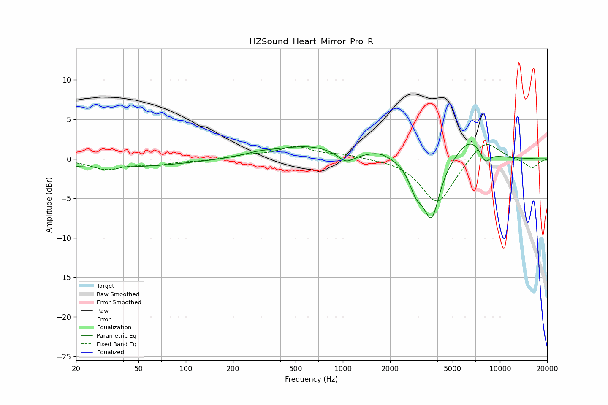

# HZSound_Heart_Mirror_Pro_R
See [usage instructions](https://github.com/jaakkopasanen/AutoEq#usage) for more options and info.

### Parametric EQs
Apply preamp of -2.0 dB when using parametric equalizer.

|   # | Type    |   Fc (Hz) |    Q |   Gain (dB) |
|-----|---------|-----------|------|-------------|
|   1 | Peaking |        24 | 3.62 |        -0   |
|   2 | Peaking |        33 | 0.31 |        -1.1 |
|   3 | Peaking |       300 | 1.23 |         0.5 |
|   4 | Peaking |       609 | 0.72 |         1.5 |
|   5 | Peaking |      1047 | 2.79 |        -1.3 |
|   6 | Peaking |      1712 | 1.78 |         0.8 |
|   7 | Peaking |      2924 | 3.3  |        -2.8 |
|   8 | Peaking |      3669 | 2.69 |        -7.3 |
|   9 | Peaking |      6447 | 1.51 |         2.8 |
|  10 | Peaking |      8054 | 4.11 |        -1.6 |

### Fixed Band EQs
When using fixed band (also called graphic) equalizer, apply preamp of **-1.9 dB** (if available) and set gains manually with these parameters.

|   # | Type    |   Fc (Hz) |    Q |   Gain (dB) |
|-----|---------|-----------|------|-------------|
|   1 | Peaking |        31 | 1.41 |        -1.2 |
|   2 | Peaking |        62 | 1.41 |        -0.6 |
|   3 | Peaking |       125 | 1.41 |        -0.2 |
|   4 | Peaking |       250 | 1.41 |         0.4 |
|   5 | Peaking |       500 | 1.41 |         1.5 |
|   6 | Peaking |      1000 | 1.41 |         0.5 |
|   7 | Peaking |      2000 | 1.41 |         0   |
|   8 | Peaking |      4000 | 1.41 |        -5.7 |
|   9 | Peaking |      8000 | 1.41 |         2.7 |
|  10 | Peaking |     16000 | 1.41 |        -1.2 |

### Graphs

