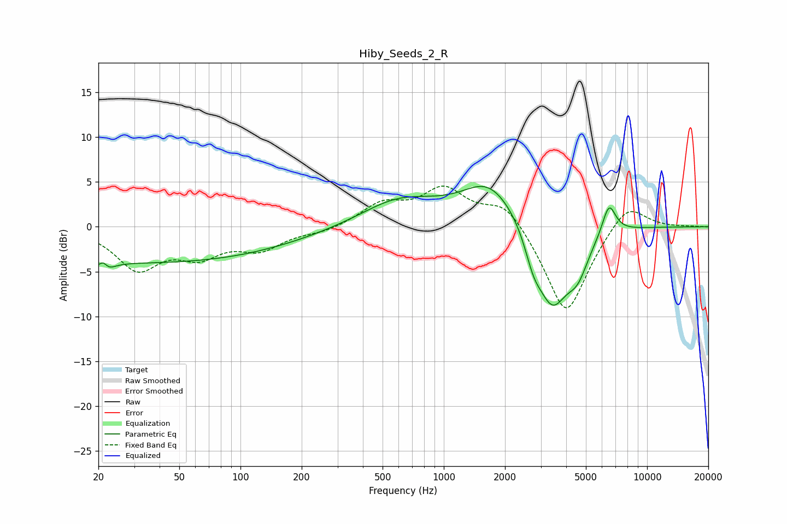

# Hiby_Seeds_2_R
See [usage instructions](https://github.com/jaakkopasanen/AutoEq#usage) for more options and info.

### Parametric EQs
Apply preamp of -4.6 dB when using parametric equalizer.

|   # | Type    |   Fc (Hz) |    Q |   Gain (dB) |
|-----|---------|-----------|------|-------------|
|   1 | Peaking |        21 | 5.92 |         2.9 |
|   2 | Peaking |        21 | 4.44 |        -3.1 |
|   3 | Peaking |        35 | 0.18 |        -4   |
|   4 | Peaking |       596 | 0.76 |         2.8 |
|   5 | Peaking |      1635 | 1.27 |         2.5 |
|   6 | Peaking |      2347 | 0.59 |         4.1 |
|   7 | Peaking |      2753 | 3.37 |        -2.5 |
|   8 | Peaking |      3409 | 1.46 |       -11.1 |
|   9 | Peaking |      4561 | 2.67 |        -3.1 |
|  10 | Peaking |      6493 | 4.06 |         3.5 |

### Fixed Band EQs
When using fixed band (also called graphic) equalizer, apply preamp of **-4.6 dB** (if available) and set gains manually with these parameters.

|   # | Type    |   Fc (Hz) |    Q |   Gain (dB) |
|-----|---------|-----------|------|-------------|
|   1 | Peaking |        31 | 1.41 |        -4.5 |
|   2 | Peaking |        62 | 1.41 |        -2.7 |
|   3 | Peaking |       125 | 1.41 |        -2.2 |
|   4 | Peaking |       250 | 1.41 |        -0.6 |
|   5 | Peaking |       500 | 1.41 |         2.4 |
|   6 | Peaking |      1000 | 1.41 |         4   |
|   7 | Peaking |      2000 | 1.41 |         3   |
|   8 | Peaking |      4000 | 1.41 |       -10.1 |
|   9 | Peaking |      8000 | 1.41 |         3.1 |
|  10 | Peaking |     16000 | 1.41 |         0.1 |

### Graphs

