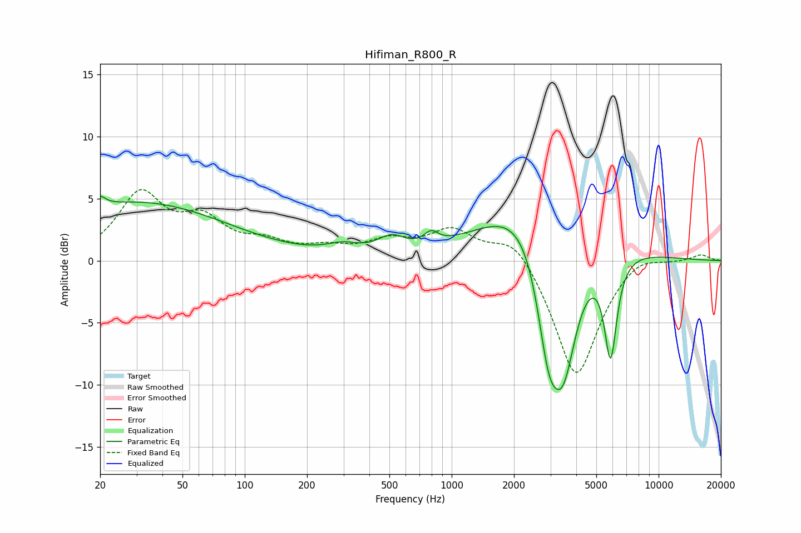

# Hifiman_R800_R
See [usage instructions](https://github.com/jaakkopasanen/AutoEq#usage) for more options and info.

### Parametric EQs
Apply preamp of -5.3 dB when using parametric equalizer.

|   # | Type    |   Fc (Hz) |    Q |   Gain (dB) |
|-----|---------|-----------|------|-------------|
|   1 | Peaking |        20 | 5.57 |         0.8 |
|   2 | Peaking |        29 | 0.32 |         4.1 |
|   3 | Peaking |        37 | 0.27 |         0.6 |
|   4 | Peaking |       298 | 1.8  |         0.7 |
|   5 | Peaking |       510 | 2.16 |         1.2 |
|   6 | Peaking |       796 | 4.3  |         0.9 |
|   7 | Peaking |      2794 | 0.65 |         8.4 |
|   8 | Peaking |      2933 | 2.31 |        -8.4 |
|   9 | Peaking |      3466 | 1.72 |       -12.2 |
|  10 | Peaking |      5861 | 4.5  |        -8.2 |

### Fixed Band EQs
When using fixed band (also called graphic) equalizer, apply preamp of **-5.8 dB** (if available) and set gains manually with these parameters.

|   # | Type    |   Fc (Hz) |    Q |   Gain (dB) |
|-----|---------|-----------|------|-------------|
|   1 | Peaking |        31 | 1.41 |         5.1 |
|   2 | Peaking |        62 | 1.41 |         2.8 |
|   3 | Peaking |       125 | 1.41 |         1.2 |
|   4 | Peaking |       250 | 1.41 |         0.8 |
|   5 | Peaking |       500 | 1.41 |         1.4 |
|   6 | Peaking |      1000 | 1.41 |         2.3 |
|   7 | Peaking |      2000 | 1.41 |         2.2 |
|   8 | Peaking |      4000 | 1.41 |        -9.6 |
|   9 | Peaking |      8000 | 1.41 |         0.9 |
|  10 | Peaking |     16000 | 1.41 |         0.5 |

### Graphs

