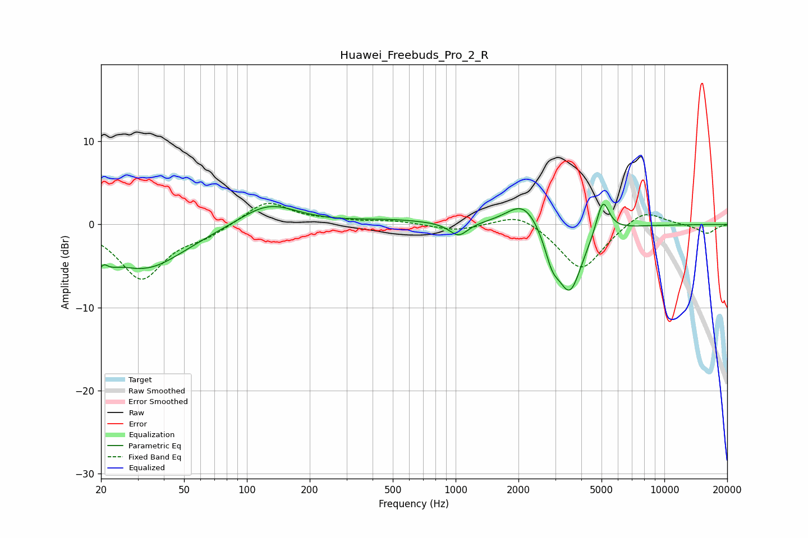

# Huawei_Freebuds_Pro_2_R
See [usage instructions](https://github.com/jaakkopasanen/AutoEq#usage) for more options and info.

### Parametric EQs
Apply preamp of -2.6 dB when using parametric equalizer.

|   # | Type    |   Fc (Hz) |    Q |   Gain (dB) |
|-----|---------|-----------|------|-------------|
|   1 | Peaking |        20 | 3.84 |        -4.7 |
|   2 | Peaking |        21 | 5.99 |         3   |
|   3 | Peaking |        33 | 0.74 |        -5.2 |
|   4 | Peaking |       127 | 1.03 |         2.7 |
|   5 | Peaking |       487 | 0.78 |         0.5 |
|   6 | Peaking |      1033 | 3.21 |        -1.7 |
|   7 | Peaking |      2126 | 1.73 |         3.3 |
|   8 | Peaking |      2896 | 3.99 |        -2.8 |
|   9 | Peaking |      3525 | 2.28 |        -8.2 |
|  10 | Peaking |      5070 | 4.48 |         4.3 |

### Fixed Band EQs
When using fixed band (also called graphic) equalizer, apply preamp of **-2.6 dB** (if available) and set gains manually with these parameters.

|   # | Type    |   Fc (Hz) |    Q |   Gain (dB) |
|-----|---------|-----------|------|-------------|
|   1 | Peaking |        31 | 1.41 |        -6.5 |
|   2 | Peaking |        62 | 1.41 |        -1.1 |
|   3 | Peaking |       125 | 1.41 |         2.9 |
|   4 | Peaking |       250 | 1.41 |         0.4 |
|   5 | Peaking |       500 | 1.41 |         0.4 |
|   6 | Peaking |      1000 | 1.41 |        -0.8 |
|   7 | Peaking |      2000 | 1.41 |         1.6 |
|   8 | Peaking |      4000 | 1.41 |        -5.6 |
|   9 | Peaking |      8000 | 1.41 |         2   |
|  10 | Peaking |     16000 | 1.41 |        -1.1 |

### Graphs

