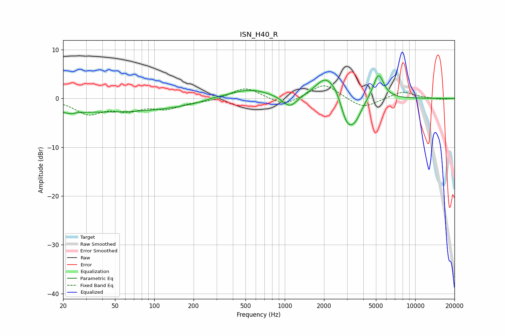

# ISN_H40_R
See [usage instructions](https://github.com/jaakkopasanen/AutoEq#usage) for more options and info.

### Parametric EQs
Apply preamp of -4.7 dB when using parametric equalizer.

|   # | Type    |   Fc (Hz) |    Q |   Gain (dB) |
|-----|---------|-----------|------|-------------|
|   1 | Peaking |        22 | 3.4  |        -0.5 |
|   2 | Peaking |        42 | 0.2  |        -2.8 |
|   3 | Peaking |       292 | 1.96 |         0.3 |
|   4 | Peaking |       529 | 0.92 |         2.1 |
|   5 | Peaking |      1093 | 2.56 |        -2.5 |
|   6 | Peaking |      2080 | 1.74 |         4.8 |
|   7 | Peaking |      2504 | 3.75 |         1.2 |
|   8 | Peaking |      3015 | 2.5  |        -5.8 |
|   9 | Peaking |      3513 | 2.9  |        -2.8 |
|  10 | Peaking |      5226 | 3.4  |         5.3 |

### Fixed Band EQs
When using fixed band (also called graphic) equalizer, apply preamp of **-2.7 dB** (if available) and set gains manually with these parameters.

|   # | Type    |   Fc (Hz) |    Q |   Gain (dB) |
|-----|---------|-----------|------|-------------|
|   1 | Peaking |        31 | 1.41 |        -3   |
|   2 | Peaking |        62 | 1.41 |        -2   |
|   3 | Peaking |       125 | 1.41 |        -1.8 |
|   4 | Peaking |       250 | 1.41 |        -0.5 |
|   5 | Peaking |       500 | 1.41 |         2.3 |
|   6 | Peaking |      1000 | 1.41 |        -1.7 |
|   7 | Peaking |      2000 | 1.41 |         3.1 |
|   8 | Peaking |      4000 | 1.41 |        -2.2 |
|   9 | Peaking |      8000 | 1.41 |         1.5 |
|  10 | Peaking |     16000 | 1.41 |        -0.2 |

### Graphs

