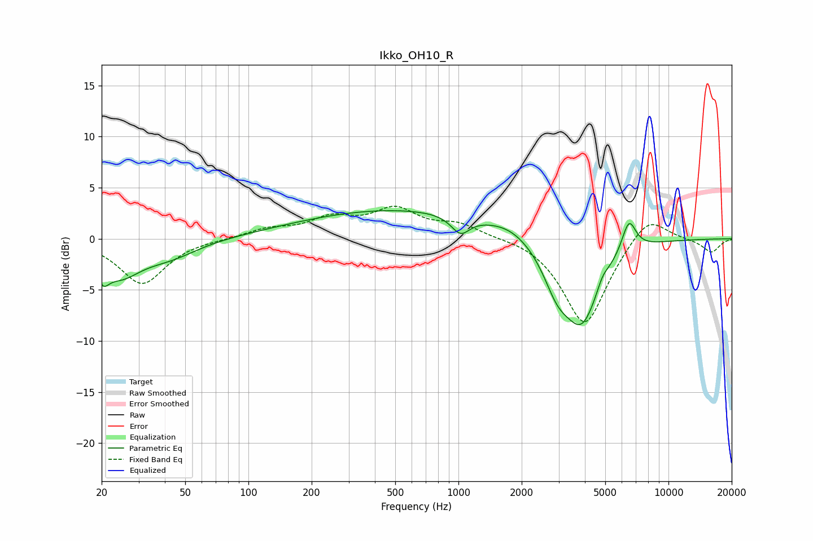

# Ikko_OH10_R
See [usage instructions](https://github.com/jaakkopasanen/AutoEq#usage) for more options and info.

### Parametric EQs
Apply preamp of -2.8 dB when using parametric equalizer.

|   # | Type    |   Fc (Hz) |    Q |   Gain (dB) |
|-----|---------|-----------|------|-------------|
|   1 | Peaking |        20 | 4.9  |        -1.9 |
|   2 | Peaking |        24 | 1.44 |        -3.1 |
|   3 | Peaking |        42 | 1.03 |        -1.6 |
|   4 | Peaking |       543 | 0.28 |         2.9 |
|   5 | Peaking |      1023 | 3.2  |        -1.7 |
|   6 | Peaking |      1764 | 1.63 |         0.5 |
|   7 | Peaking |      2952 | 2.08 |        -3.5 |
|   8 | Peaking |      3878 | 1.62 |        -7.7 |
|   9 | Peaking |      4854 | 5.59 |         0.8 |
|  10 | Peaking |      6481 | 4.02 |         3.1 |

### Fixed Band EQs
When using fixed band (also called graphic) equalizer, apply preamp of **-3.3 dB** (if available) and set gains manually with these parameters.

|   # | Type    |   Fc (Hz) |    Q |   Gain (dB) |
|-----|---------|-----------|------|-------------|
|   1 | Peaking |        31 | 1.41 |        -4.4 |
|   2 | Peaking |        62 | 1.41 |        -0   |
|   3 | Peaking |       125 | 1.41 |         0.9 |
|   4 | Peaking |       250 | 1.41 |         1.8 |
|   5 | Peaking |       500 | 1.41 |         2.7 |
|   6 | Peaking |      1000 | 1.41 |         1.3 |
|   7 | Peaking |      2000 | 1.41 |         0.2 |
|   8 | Peaking |      4000 | 1.41 |        -8.6 |
|   9 | Peaking |      8000 | 1.41 |         2.7 |
|  10 | Peaking |     16000 | 1.41 |        -1.3 |

### Graphs

