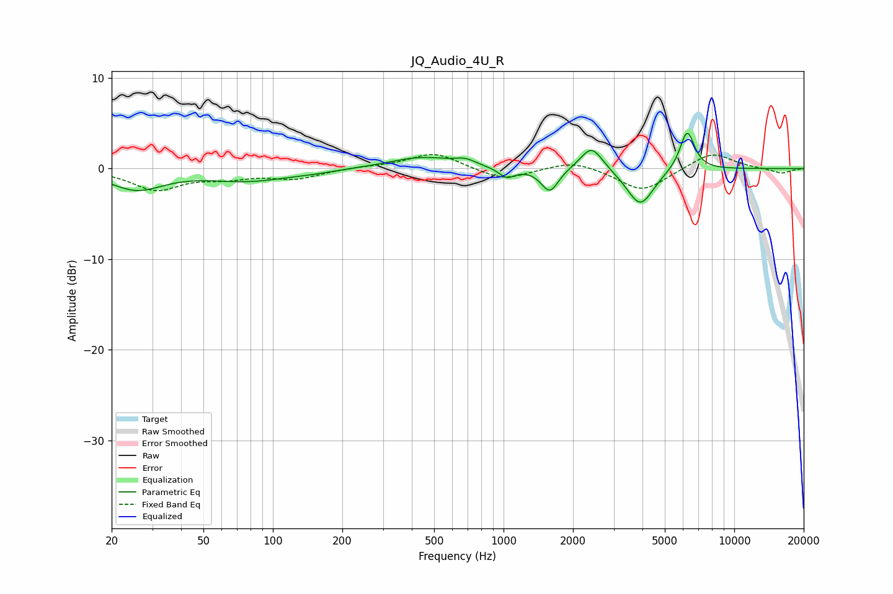

# JQ_Audio_4U_R
See [usage instructions](https://github.com/jaakkopasanen/AutoEq#usage) for more options and info.

### Parametric EQs
Apply preamp of -4.0 dB when using parametric equalizer.

|   # | Type    |   Fc (Hz) |    Q |   Gain (dB) |
|-----|---------|-----------|------|-------------|
|   1 | Peaking |        26 | 1.22 |        -2.2 |
|   2 | Peaking |        79 | 0.8  |        -1.3 |
|   3 | Peaking |       149 | 1.33 |        -0.2 |
|   4 | Peaking |       443 | 0.98 |         1.3 |
|   5 | Peaking |       682 | 3.26 |         0.6 |
|   6 | Peaking |      1032 | 3.99 |        -1.1 |
|   7 | Peaking |      1587 | 3.77 |        -2.6 |
|   8 | Peaking |      2408 | 2.93 |         2.7 |
|   9 | Peaking |      3913 | 2.41 |        -4.1 |
|  10 | Peaking |      6248 | 4.29 |         4.4 |

### Fixed Band EQs
When using fixed band (also called graphic) equalizer, apply preamp of **-1.6 dB** (if available) and set gains manually with these parameters.

|   # | Type    |   Fc (Hz) |    Q |   Gain (dB) |
|-----|---------|-----------|------|-------------|
|   1 | Peaking |        31 | 1.41 |        -2.3 |
|   2 | Peaking |        62 | 1.41 |        -0.8 |
|   3 | Peaking |       125 | 1.41 |        -1.1 |
|   4 | Peaking |       250 | 1.41 |         0.2 |
|   5 | Peaking |       500 | 1.41 |         1.8 |
|   6 | Peaking |      1000 | 1.41 |        -1.3 |
|   7 | Peaking |      2000 | 1.41 |         1   |
|   8 | Peaking |      4000 | 1.41 |        -2.6 |
|   9 | Peaking |      8000 | 1.41 |         1.9 |
|  10 | Peaking |     16000 | 1.41 |        -0.6 |

### Graphs

