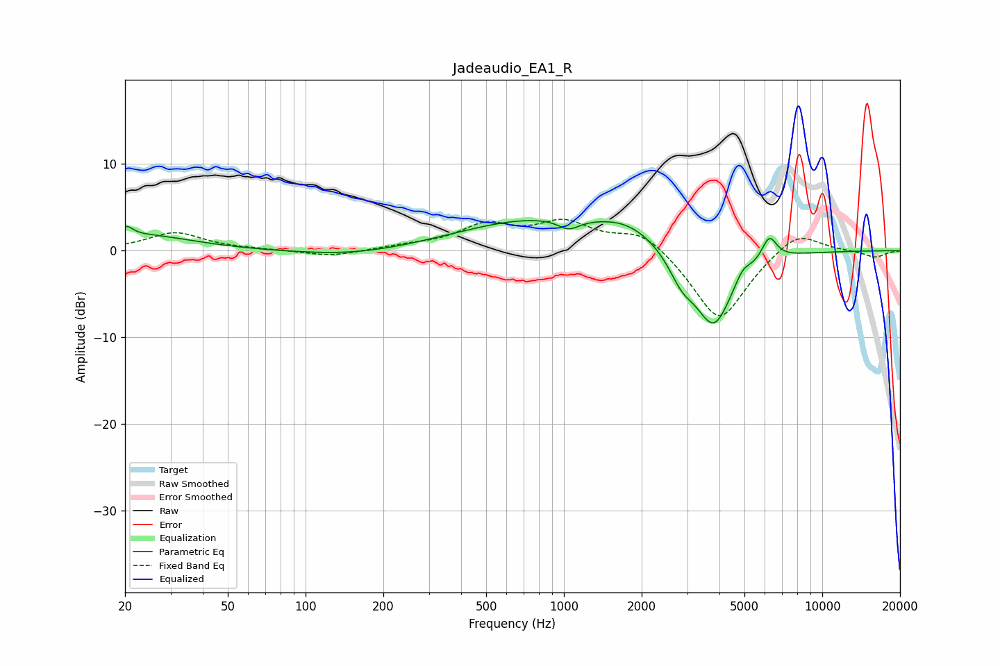

# Jadeaudio_EA1_R
See [usage instructions](https://github.com/jaakkopasanen/AutoEq#usage) for more options and info.

### Parametric EQs
Apply preamp of -3.6 dB when using parametric equalizer.

|   # | Type    |   Fc (Hz) |    Q |   Gain (dB) |
|-----|---------|-----------|------|-------------|
|   1 | Peaking |        20 | 5.74 |         1.1 |
|   2 | Peaking |        23 | 0.73 |         1.8 |
|   3 | Peaking |       153 | 0.65 |        -0.8 |
|   4 | Peaking |       762 | 0.48 |         3.5 |
|   5 | Peaking |      1044 | 3.47 |        -1.2 |
|   6 | Peaking |      1774 | 1.08 |         2.2 |
|   7 | Peaking |      2860 | 2.78 |        -2.7 |
|   8 | Peaking |      3802 | 1.85 |        -8.9 |
|   9 | Peaking |      4915 | 4.79 |         1.3 |
|  10 | Peaking |      6236 | 4.7  |         2.8 |

### Fixed Band EQs
When using fixed band (also called graphic) equalizer, apply preamp of **-3.7 dB** (if available) and set gains manually with these parameters.

|   # | Type    |   Fc (Hz) |    Q |   Gain (dB) |
|-----|---------|-----------|------|-------------|
|   1 | Peaking |        31 | 1.41 |         2.1 |
|   2 | Peaking |        62 | 1.41 |         0.1 |
|   3 | Peaking |       125 | 1.41 |        -0.7 |
|   4 | Peaking |       250 | 1.41 |         0.4 |
|   5 | Peaking |       500 | 1.41 |         2.7 |
|   6 | Peaking |      1000 | 1.41 |         3   |
|   7 | Peaking |      2000 | 1.41 |         2.4 |
|   8 | Peaking |      4000 | 1.41 |        -8.4 |
|   9 | Peaking |      8000 | 1.41 |         2.6 |
|  10 | Peaking |     16000 | 1.41 |        -0.8 |

### Graphs

