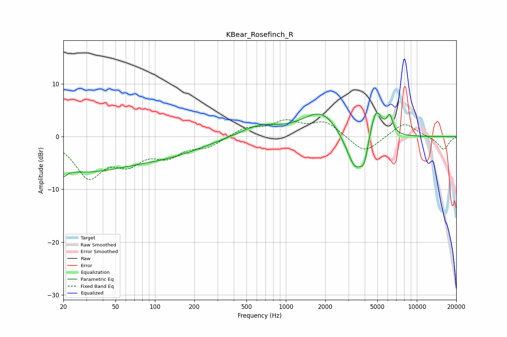

# KBear_Rosefinch_R
See [usage instructions](https://github.com/jaakkopasanen/AutoEq#usage) for more options and info.

### Parametric EQs
Apply preamp of -4.6 dB when using parametric equalizer.

|   # | Type    |   Fc (Hz) |    Q |   Gain (dB) |
|-----|---------|-----------|------|-------------|
|   1 | Peaking |        20 | 5.83 |        -6.2 |
|   2 | Peaking |        20 | 5.99 |         4.6 |
|   3 | Peaking |        28 | 0.39 |        -6.1 |
|   4 | Peaking |       128 | 0.5  |        -2.6 |
|   5 | Peaking |       619 | 0.93 |         2.1 |
|   6 | Peaking |      1874 | 1.01 |         4.9 |
|   7 | Peaking |      3380 | 1.99 |        -7.6 |
|   8 | Peaking |      3960 | 5.02 |        -3.3 |
|   9 | Peaking |      4867 | 3.07 |         6.1 |
|  10 | Peaking |      6205 | 5.97 |         3.2 |

### Fixed Band EQs
When using fixed band (also called graphic) equalizer, apply preamp of **-3.3 dB** (if available) and set gains manually with these parameters.

|   # | Type    |   Fc (Hz) |    Q |   Gain (dB) |
|-----|---------|-----------|------|-------------|
|   1 | Peaking |        31 | 1.41 |        -7.2 |
|   2 | Peaking |        62 | 1.41 |        -4.1 |
|   3 | Peaking |       125 | 1.41 |        -3.1 |
|   4 | Peaking |       250 | 1.41 |        -1.7 |
|   5 | Peaking |       500 | 1.41 |         1.6 |
|   6 | Peaking |      1000 | 1.41 |         2.6 |
|   7 | Peaking |      2000 | 1.41 |         2.7 |
|   8 | Peaking |      4000 | 1.41 |        -3.3 |
|   9 | Peaking |      8000 | 1.41 |         2.8 |
|  10 | Peaking |     16000 | 1.41 |        -2.5 |

### Graphs

