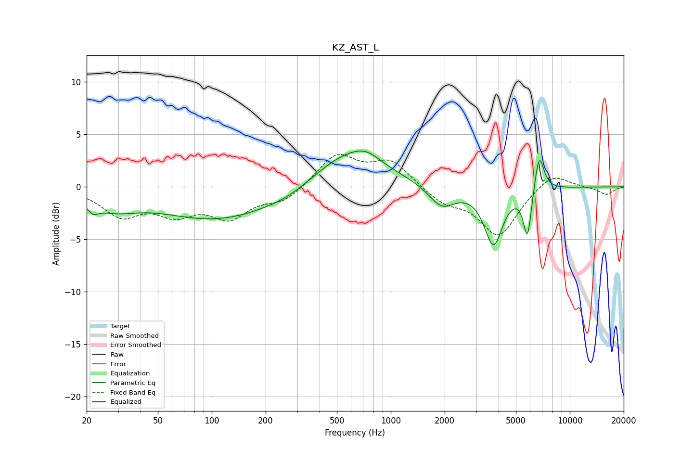

# KZ_AST_L
See [usage instructions](https://github.com/jaakkopasanen/AutoEq#usage) for more options and info.

### Parametric EQs
Apply preamp of -3.5 dB when using parametric equalizer.

|   # | Type    |   Fc (Hz) |    Q |   Gain (dB) |
|-----|---------|-----------|------|-------------|
|   1 | Peaking |        22 | 4.76 |        -0.8 |
|   2 | Peaking |        28 | 1.05 |        -1.6 |
|   3 | Peaking |       108 | 0.44 |        -3.1 |
|   4 | Peaking |       270 | 1.06 |        -0.6 |
|   5 | Peaking |       581 | 0.71 |         3.5 |
|   6 | Peaking |       726 | 1.92 |         0.8 |
|   7 | Peaking |      1931 | 1.92 |        -2.1 |
|   8 | Peaking |      3748 | 2.75 |        -5.4 |
|   9 | Peaking |      5802 | 5.98 |        -4.7 |
|  10 | Peaking |      6739 | 5.1  |         3.8 |

### Fixed Band EQs
When using fixed band (also called graphic) equalizer, apply preamp of **-3.2 dB** (if available) and set gains manually with these parameters.

|   # | Type    |   Fc (Hz) |    Q |   Gain (dB) |
|-----|---------|-----------|------|-------------|
|   1 | Peaking |        31 | 1.41 |        -2.5 |
|   2 | Peaking |        62 | 1.41 |        -2.2 |
|   3 | Peaking |       125 | 1.41 |        -2.7 |
|   4 | Peaking |       250 | 1.41 |        -1.3 |
|   5 | Peaking |       500 | 1.41 |         3.1 |
|   6 | Peaking |      1000 | 1.41 |         2.4 |
|   7 | Peaking |      2000 | 1.41 |        -1.4 |
|   8 | Peaking |      4000 | 1.41 |        -4.6 |
|   9 | Peaking |      8000 | 1.41 |         1.5 |
|  10 | Peaking |     16000 | 1.41 |        -0.7 |

### Graphs

