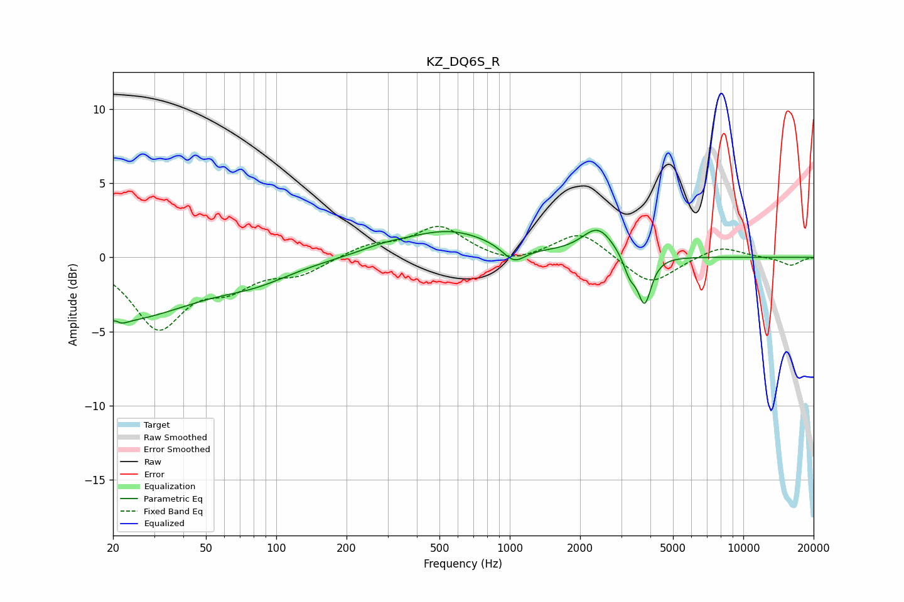

# KZ_DQ6S_R
See [usage instructions](https://github.com/jaakkopasanen/AutoEq#usage) for more options and info.

### Parametric EQs
Apply preamp of -1.9 dB when using parametric equalizer.

|   # | Type    |   Fc (Hz) |    Q |   Gain (dB) |
|-----|---------|-----------|------|-------------|
|   1 | Peaking |        20 | 0.41 |        -4.2 |
|   2 | Peaking |        21 | 5.95 |         3.2 |
|   3 | Peaking |        21 | 5.8  |        -3.3 |
|   4 | Peaking |        82 | 0.9  |        -0.9 |
|   5 | Peaking |       288 | 1.34 |         0.4 |
|   6 | Peaking |       551 | 0.74 |         1.8 |
|   7 | Peaking |      1043 | 2.89 |        -1.1 |
|   8 | Peaking |      2384 | 2.07 |         1.9 |
|   9 | Peaking |      3265 | 5.19 |        -1.3 |
|  10 | Peaking |      3780 | 4.95 |        -3.2 |

### Fixed Band EQs
When using fixed band (also called graphic) equalizer, apply preamp of **-2.2 dB** (if available) and set gains manually with these parameters.

|   # | Type    |   Fc (Hz) |    Q |   Gain (dB) |
|-----|---------|-----------|------|-------------|
|   1 | Peaking |        31 | 1.41 |        -4.6 |
|   2 | Peaking |        62 | 1.41 |        -1.6 |
|   3 | Peaking |       125 | 1.41 |        -1   |
|   4 | Peaking |       250 | 1.41 |         0.8 |
|   5 | Peaking |       500 | 1.41 |         2   |
|   6 | Peaking |      1000 | 1.41 |        -0.6 |
|   7 | Peaking |      2000 | 1.41 |         1.8 |
|   8 | Peaking |      4000 | 1.41 |        -1.9 |
|   9 | Peaking |      8000 | 1.41 |         0.8 |
|  10 | Peaking |     16000 | 1.41 |        -0.5 |

### Graphs

