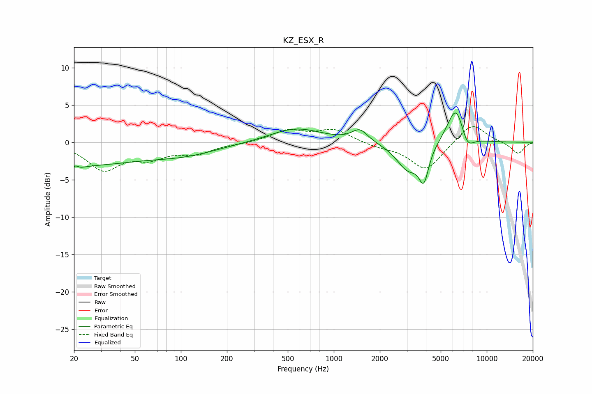

# KZ_ESX_R
See [usage instructions](https://github.com/jaakkopasanen/AutoEq#usage) for more options and info.

### Parametric EQs
Apply preamp of -4.0 dB when using parametric equalizer.

|   # | Type    |   Fc (Hz) |    Q |   Gain (dB) |
|-----|---------|-----------|------|-------------|
|   1 | Peaking |        20 | 0.34 |        -3   |
|   2 | Peaking |        21 | 5.89 |         2.8 |
|   3 | Peaking |        21 | 5.15 |        -2.8 |
|   4 | Peaking |       106 | 0.62 |        -1.3 |
|   5 | Peaking |       566 | 0.83 |         1.9 |
|   6 | Peaking |      1478 | 2.72 |         1.6 |
|   7 | Peaking |      3054 | 1.83 |        -3.6 |
|   8 | Peaking |      3877 | 4.37 |        -4.2 |
|   9 | Peaking |      6306 | 2.35 |         5.4 |
|  10 | Peaking |      7415 | 3.08 |        -2.4 |

### Fixed Band EQs
When using fixed band (also called graphic) equalizer, apply preamp of **-2.2 dB** (if available) and set gains manually with these parameters.

|   # | Type    |   Fc (Hz) |    Q |   Gain (dB) |
|-----|---------|-----------|------|-------------|
|   1 | Peaking |        31 | 1.41 |        -3.5 |
|   2 | Peaking |        62 | 1.41 |        -1.8 |
|   3 | Peaking |       125 | 1.41 |        -1.3 |
|   4 | Peaking |       250 | 1.41 |        -0.1 |
|   5 | Peaking |       500 | 1.41 |         1.5 |
|   6 | Peaking |      1000 | 1.41 |         1.7 |
|   7 | Peaking |      2000 | 1.41 |        -0.5 |
|   8 | Peaking |      4000 | 1.41 |        -3.8 |
|   9 | Peaking |      8000 | 1.41 |         2.7 |
|  10 | Peaking |     16000 | 1.41 |        -1.6 |

### Graphs

