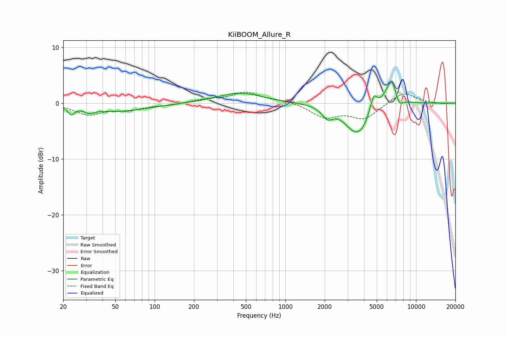

# KiiBOOM_Allure_R
See [usage instructions](https://github.com/jaakkopasanen/AutoEq#usage) for more options and info.

### Parametric EQs
Apply preamp of -3.8 dB when using parametric equalizer.

|   # | Type    |   Fc (Hz) |    Q |   Gain (dB) |
|-----|---------|-----------|------|-------------|
|   1 | Peaking |        23 | 5.99 |        -1.4 |
|   2 | Peaking |        32 | 3.88 |        -0.8 |
|   3 | Peaking |        52 | 0.61 |        -1.5 |
|   4 | Peaking |       447 | 0.84 |         1.9 |
|   5 | Peaking |      2101 | 3.43 |        -1.9 |
|   6 | Peaking |      3464 | 1.61 |        -5.1 |
|   7 | Peaking |      3913 | 3.77 |        -0.8 |
|   8 | Peaking |      4748 | 5.41 |         2.8 |
|   9 | Peaking |      6509 | 2.91 |         5.1 |
|  10 | Peaking |      7387 | 4.36 |        -2.1 |

### Fixed Band EQs
When using fixed band (also called graphic) equalizer, apply preamp of **-2.0 dB** (if available) and set gains manually with these parameters.

|   # | Type    |   Fc (Hz) |    Q |   Gain (dB) |
|-----|---------|-----------|------|-------------|
|   1 | Peaking |        31 | 1.41 |        -2   |
|   2 | Peaking |        62 | 1.41 |        -1.1 |
|   3 | Peaking |       125 | 1.41 |        -0.3 |
|   4 | Peaking |       250 | 1.41 |         0.6 |
|   5 | Peaking |       500 | 1.41 |         1.9 |
|   6 | Peaking |      1000 | 1.41 |         0.5 |
|   7 | Peaking |      2000 | 1.41 |        -2.4 |
|   8 | Peaking |      4000 | 1.41 |        -2.7 |
|   9 | Peaking |      8000 | 1.41 |         2.1 |
|  10 | Peaking |     16000 | 1.41 |        -0.2 |

### Graphs

