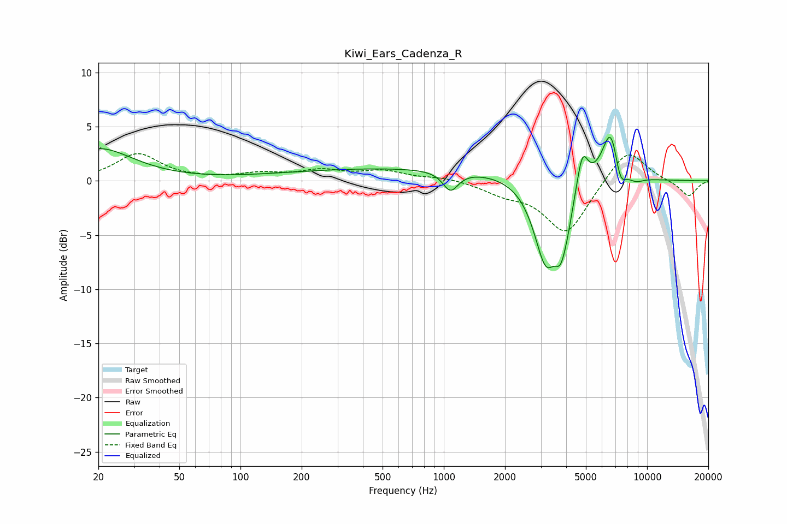

# Kiwi_Ears_Cadenza_R
See [usage instructions](https://github.com/jaakkopasanen/AutoEq#usage) for more options and info.

### Parametric EQs
Apply preamp of -4.1 dB when using parametric equalizer.

|   # | Type    |   Fc (Hz) |    Q |   Gain (dB) |
|-----|---------|-----------|------|-------------|
|   1 | Peaking |        20 | 0.83 |         2.9 |
|   2 | Peaking |       785 | 0.18 |         1.2 |
|   3 | Peaking |      1080 | 3.73 |        -1.8 |
|   4 | Peaking |      3184 | 2.33 |        -7.9 |
|   5 | Peaking |      3739 | 5.27 |        -2.6 |
|   6 | Peaking |      4021 | 4.11 |        -2.3 |
|   7 | Peaking |      4802 | 5.07 |         3.4 |
|   8 | Peaking |      6651 | 3.15 |         5.2 |
|   9 | Peaking |      7354 | 4.59 |        -2.5 |
|  10 | Peaking |      8784 | 3.45 |        -0.5 |

### Fixed Band EQs
When using fixed band (also called graphic) equalizer, apply preamp of **-2.6 dB** (if available) and set gains manually with these parameters.

|   # | Type    |   Fc (Hz) |    Q |   Gain (dB) |
|-----|---------|-----------|------|-------------|
|   1 | Peaking |        31 | 1.41 |         2.5 |
|   2 | Peaking |        62 | 1.41 |         0.1 |
|   3 | Peaking |       125 | 1.41 |         0.6 |
|   4 | Peaking |       250 | 1.41 |         0.8 |
|   5 | Peaking |       500 | 1.41 |         0.8 |
|   6 | Peaking |      1000 | 1.41 |         0.3 |
|   7 | Peaking |      2000 | 1.41 |        -1   |
|   8 | Peaking |      4000 | 1.41 |        -4.9 |
|   9 | Peaking |      8000 | 1.41 |         3.2 |
|  10 | Peaking |     16000 | 1.41 |        -1.5 |

### Graphs

