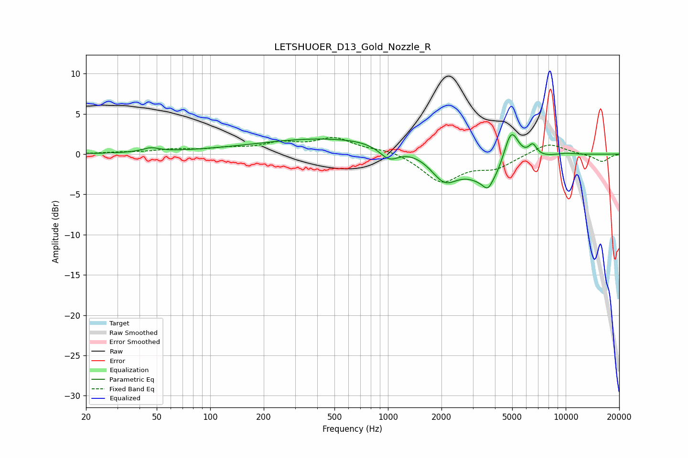

# LETSHUOER_D13_Gold_Nozzle_R
See [usage instructions](https://github.com/jaakkopasanen/AutoEq#usage) for more options and info.

### Parametric EQs
Apply preamp of -2.5 dB when using parametric equalizer.

|   # | Type    |   Fc (Hz) |    Q |   Gain (dB) |
|-----|---------|-----------|------|-------------|
|   1 | Peaking |        46 | 3.03 |         0.5 |
|   2 | Peaking |        78 | 0.59 |         0.1 |
|   3 | Peaking |       514 | 0.31 |         2   |
|   4 | Peaking |      1016 | 2.56 |        -1.7 |
|   5 | Peaking |      2076 | 1.83 |        -3.2 |
|   6 | Peaking |      3644 | 5.62 |        -1.1 |
|   7 | Peaking |      3807 | 1.21 |        -4   |
|   8 | Peaking |      4922 | 3.12 |         5.1 |
|   9 | Peaking |      6526 | 5.77 |         1.4 |
|  10 | Peaking |     10000 | 2.04 |         0.2 |

### Fixed Band EQs
When using fixed band (also called graphic) equalizer, apply preamp of **-2.2 dB** (if available) and set gains manually with these parameters.

|   # | Type    |   Fc (Hz) |    Q |   Gain (dB) |
|-----|---------|-----------|------|-------------|
|   1 | Peaking |        31 | 1.41 |         0.2 |
|   2 | Peaking |        62 | 1.41 |         0.5 |
|   3 | Peaking |       125 | 1.41 |         0.6 |
|   4 | Peaking |       250 | 1.41 |         1.2 |
|   5 | Peaking |       500 | 1.41 |         1.8 |
|   6 | Peaking |      1000 | 1.41 |         0.6 |
|   7 | Peaking |      2000 | 1.41 |        -3.4 |
|   8 | Peaking |      4000 | 1.41 |        -1.6 |
|   9 | Peaking |      8000 | 1.41 |         1.5 |
|  10 | Peaking |     16000 | 1.41 |        -1   |

### Graphs

