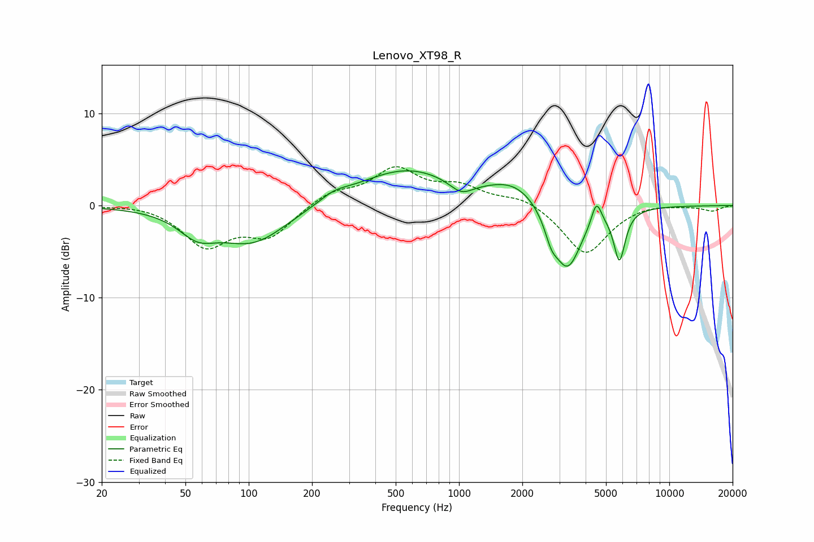

# Lenovo_XT98_R
See [usage instructions](https://github.com/jaakkopasanen/AutoEq#usage) for more options and info.

### Parametric EQs
Apply preamp of -3.9 dB when using parametric equalizer.

|   # | Type    |   Fc (Hz) |    Q |   Gain (dB) |
|-----|---------|-----------|------|-------------|
|   1 | Peaking |        57 | 1.61 |        -2.3 |
|   2 | Peaking |       105 | 0.85 |        -4   |
|   3 | Peaking |       254 | 2.09 |         0.8 |
|   4 | Peaking |       561 | 0.59 |         3.9 |
|   5 | Peaking |      1025 | 2.5  |        -1.4 |
|   6 | Peaking |      1857 | 1.14 |         2.2 |
|   7 | Peaking |      2747 | 4.7  |        -1.8 |
|   8 | Peaking |      3275 | 2.07 |        -7.2 |
|   9 | Peaking |      4502 | 6    |         2.6 |
|  10 | Peaking |      5793 | 5.13 |        -5.5 |

### Fixed Band EQs
When using fixed band (also called graphic) equalizer, apply preamp of **-4.3 dB** (if available) and set gains manually with these parameters.

|   # | Type    |   Fc (Hz) |    Q |   Gain (dB) |
|-----|---------|-----------|------|-------------|
|   1 | Peaking |        31 | 1.41 |         0.2 |
|   2 | Peaking |        62 | 1.41 |        -4.2 |
|   3 | Peaking |       125 | 1.41 |        -3.2 |
|   4 | Peaking |       250 | 1.41 |         1.4 |
|   5 | Peaking |       500 | 1.41 |         3.8 |
|   6 | Peaking |      1000 | 1.41 |         1.8 |
|   7 | Peaking |      2000 | 1.41 |         1   |
|   8 | Peaking |      4000 | 1.41 |        -5.4 |
|   9 | Peaking |      8000 | 1.41 |         0.3 |
|  10 | Peaking |     16000 | 1.41 |        -0.6 |

### Graphs

