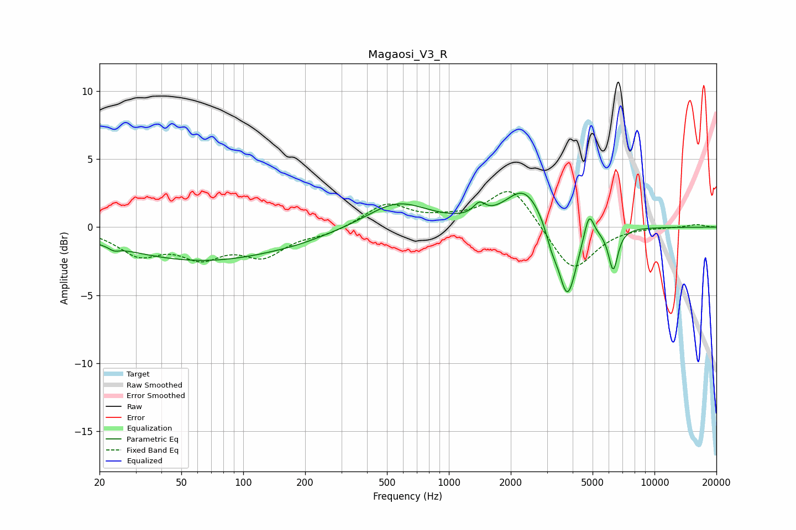

# Magaosi_V3_R
See [usage instructions](https://github.com/jaakkopasanen/AutoEq#usage) for more options and info.

### Parametric EQs
Apply preamp of -2.6 dB when using parametric equalizer.

|   # | Type    |   Fc (Hz) |    Q |   Gain (dB) |
|-----|---------|-----------|------|-------------|
|   1 | Peaking |        24 | 5.9  |        -0.3 |
|   2 | Peaking |        64 | 0.35 |        -2.5 |
|   3 | Peaking |       188 | 1.07 |        -0.2 |
|   4 | Peaking |       561 | 0.96 |         1.9 |
|   5 | Peaking |      1407 | 5.05 |         0.8 |
|   6 | Peaking |      2331 | 1.53 |         2.9 |
|   7 | Peaking |      3153 | 5.03 |        -1.1 |
|   8 | Peaking |      3772 | 3.13 |        -5.5 |
|   9 | Peaking |      4804 | 6    |         2   |
|  10 | Peaking |      6298 | 6    |        -3   |

### Fixed Band EQs
When using fixed band (also called graphic) equalizer, apply preamp of **-2.7 dB** (if available) and set gains manually with these parameters.

|   # | Type    |   Fc (Hz) |    Q |   Gain (dB) |
|-----|---------|-----------|------|-------------|
|   1 | Peaking |        31 | 1.41 |        -1.8 |
|   2 | Peaking |        62 | 1.41 |        -1.9 |
|   3 | Peaking |       125 | 1.41 |        -1.9 |
|   4 | Peaking |       250 | 1.41 |        -0.5 |
|   5 | Peaking |       500 | 1.41 |         1.7 |
|   6 | Peaking |      1000 | 1.41 |         0.4 |
|   7 | Peaking |      2000 | 1.41 |         3   |
|   8 | Peaking |      4000 | 1.41 |        -3.4 |
|   9 | Peaking |      8000 | 1.41 |         0   |
|  10 | Peaking |     16000 | 1.41 |         0.2 |

### Graphs

