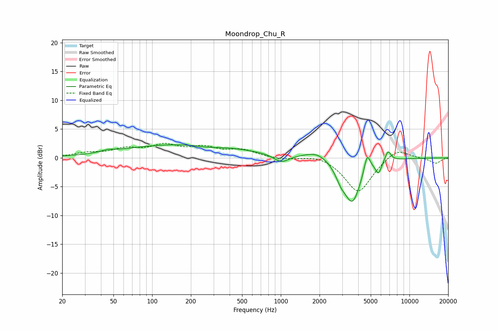

# Moondrop_Chu_R
See [usage instructions](https://github.com/jaakkopasanen/AutoEq#usage) for more options and info.

### Parametric EQs
Apply preamp of -2.4 dB when using parametric equalizer.

|   # | Type    |   Fc (Hz) |    Q |   Gain (dB) |
|-----|---------|-----------|------|-------------|
|   1 | Peaking |        45 | 2.86 |         0.4 |
|   2 | Peaking |       181 | 0.29 |         2.4 |
|   3 | Peaking |       268 | 1.34 |        -0.4 |
|   4 | Peaking |      1006 | 2.47 |        -1.4 |
|   5 | Peaking |      1903 | 1.56 |         1.3 |
|   6 | Peaking |      2922 | 3.46 |        -1.8 |
|   7 | Peaking |      3600 | 2.15 |        -7.5 |
|   8 | Peaking |      4691 | 5.93 |         3.2 |
|   9 | Peaking |      5746 | 6    |        -2   |
|  10 | Peaking |      6810 | 5.9  |         1.9 |

### Fixed Band EQs
When using fixed band (also called graphic) equalizer, apply preamp of **-2.6 dB** (if available) and set gains manually with these parameters.

|   # | Type    |   Fc (Hz) |    Q |   Gain (dB) |
|-----|---------|-----------|------|-------------|
|   1 | Peaking |        31 | 1.41 |         0.7 |
|   2 | Peaking |        62 | 1.41 |         1.3 |
|   3 | Peaking |       125 | 1.41 |         1.9 |
|   4 | Peaking |       250 | 1.41 |         1.5 |
|   5 | Peaking |       500 | 1.41 |         1.3 |
|   6 | Peaking |      1000 | 1.41 |        -0.3 |
|   7 | Peaking |      2000 | 1.41 |         0.7 |
|   8 | Peaking |      4000 | 1.41 |        -6.1 |
|   9 | Peaking |      8000 | 1.41 |         1.8 |
|  10 | Peaking |     16000 | 1.41 |        -1   |

### Graphs

