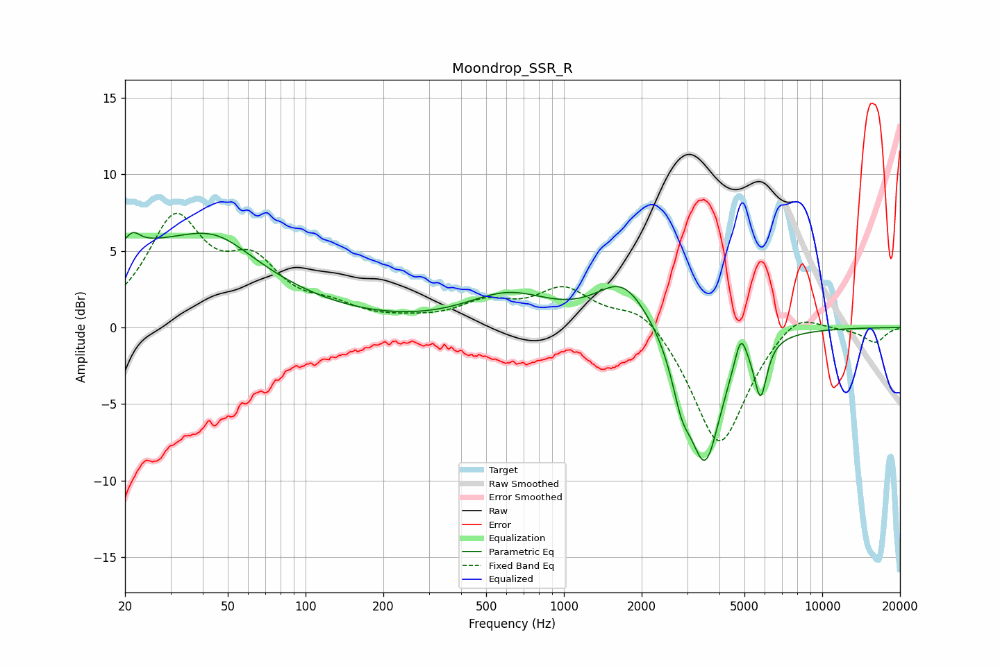

# Moondrop_SSR_R
See [usage instructions](https://github.com/jaakkopasanen/AutoEq#usage) for more options and info.

### Parametric EQs
Apply preamp of -6.3 dB when using parametric equalizer.

|   # | Type    |   Fc (Hz) |    Q |   Gain (dB) |
|-----|---------|-----------|------|-------------|
|   1 | Peaking |        22 | 5.55 |         3.3 |
|   2 | Peaking |        22 | 5.69 |        -2.5 |
|   3 | Peaking |        24 | 0.31 |         5   |
|   4 | Peaking |        45 | 1.05 |         1.7 |
|   5 | Peaking |       609 | 0.88 |         2   |
|   6 | Peaking |      1698 | 1.37 |         3   |
|   7 | Peaking |      2853 | 3.77 |        -2.6 |
|   8 | Peaking |      3523 | 2.22 |        -8.6 |
|   9 | Peaking |      4837 | 5.96 |         2.1 |
|  10 | Peaking |      5773 | 5.74 |        -3.6 |

### Fixed Band EQs
When using fixed band (also called graphic) equalizer, apply preamp of **-7.6 dB** (if available) and set gains manually with these parameters.

|   # | Type    |   Fc (Hz) |    Q |   Gain (dB) |
|-----|---------|-----------|------|-------------|
|   1 | Peaking |        31 | 1.41 |         6.8 |
|   2 | Peaking |        62 | 1.41 |         3.5 |
|   3 | Peaking |       125 | 1.41 |         1   |
|   4 | Peaking |       250 | 1.41 |         0.2 |
|   5 | Peaking |       500 | 1.41 |         1.4 |
|   6 | Peaking |      1000 | 1.41 |         2.4 |
|   7 | Peaking |      2000 | 1.41 |         1.6 |
|   8 | Peaking |      4000 | 1.41 |        -8   |
|   9 | Peaking |      8000 | 1.41 |         1.4 |
|  10 | Peaking |     16000 | 1.41 |        -1   |

### Graphs

