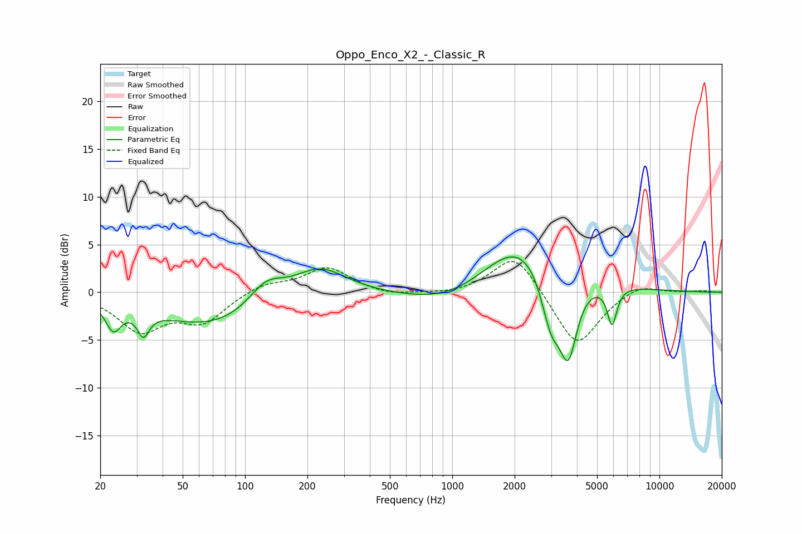

# Oppo_Enco_X2_-_Classic_R
See [usage instructions](https://github.com/jaakkopasanen/AutoEq#usage) for more options and info.

### Parametric EQs
Apply preamp of -3.8 dB when using parametric equalizer.

|   # | Type    |   Fc (Hz) |    Q |   Gain (dB) |
|-----|---------|-----------|------|-------------|
|   1 | Peaking |        23 | 3.92 |        -2.7 |
|   2 | Peaking |        32 | 5.2  |        -2.4 |
|   3 | Peaking |        75 | 0.47 |        -3.8 |
|   4 | Peaking |       126 | 1.56 |         2.9 |
|   5 | Peaking |       227 | 1.04 |         3.4 |
|   6 | Peaking |      1057 | 0.65 |        -2.4 |
|   7 | Peaking |      2198 | 0.67 |         6.6 |
|   8 | Peaking |      2994 | 2.72 |        -6.1 |
|   9 | Peaking |      3633 | 3.14 |        -8.1 |
|  10 | Peaking |      5906 | 6    |        -4.1 |

### Fixed Band EQs
When using fixed band (also called graphic) equalizer, apply preamp of **-3.3 dB** (if available) and set gains manually with these parameters.

|   # | Type    |   Fc (Hz) |    Q |   Gain (dB) |
|-----|---------|-----------|------|-------------|
|   1 | Peaking |        31 | 1.41 |        -3.8 |
|   2 | Peaking |        62 | 1.41 |        -2.9 |
|   3 | Peaking |       125 | 1.41 |         1   |
|   4 | Peaking |       250 | 1.41 |         2.6 |
|   5 | Peaking |       500 | 1.41 |        -0.5 |
|   6 | Peaking |      1000 | 1.41 |        -0.3 |
|   7 | Peaking |      2000 | 1.41 |         4.3 |
|   8 | Peaking |      4000 | 1.41 |        -5.9 |
|   9 | Peaking |      8000 | 1.41 |         1   |
|  10 | Peaking |     16000 | 1.41 |         0.2 |

### Graphs

