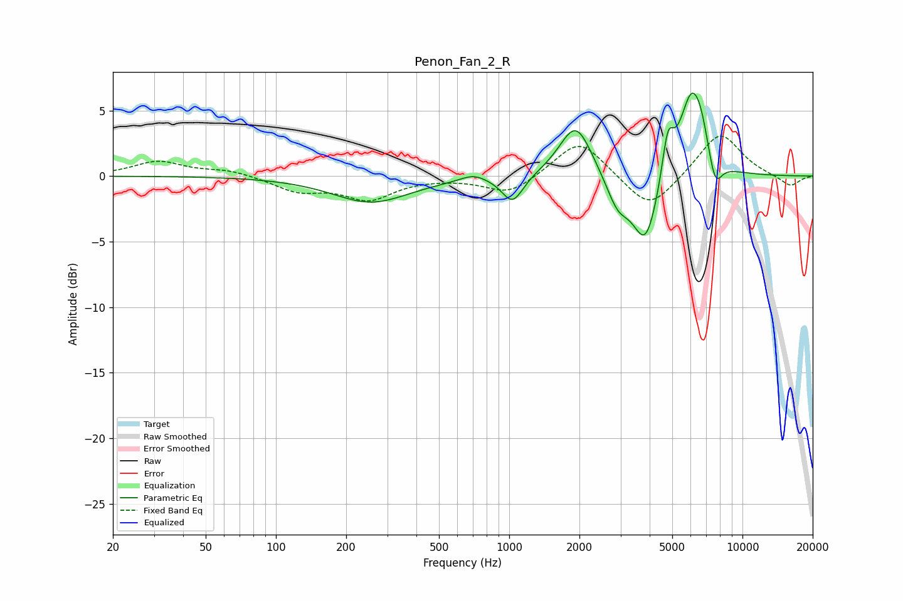

# Penon_Fan_2_R
See [usage instructions](https://github.com/jaakkopasanen/AutoEq#usage) for more options and info.

### Parametric EQs
Apply preamp of -6.4 dB when using parametric equalizer.

|   # | Type    |   Fc (Hz) |    Q |   Gain (dB) |
|-----|---------|-----------|------|-------------|
|   1 | Peaking |       256 | 0.86 |        -2   |
|   2 | Peaking |       700 | 2.65 |         0.5 |
|   3 | Peaking |      1034 | 3.07 |        -2.1 |
|   4 | Peaking |      1930 | 2.02 |         4.2 |
|   5 | Peaking |      2921 | 2.81 |        -2.3 |
|   6 | Peaking |      3846 | 2.52 |        -5.4 |
|   7 | Peaking |      4785 | 5.68 |         3.4 |
|   8 | Peaking |      6039 | 2.6  |         6.2 |
|   9 | Peaking |      6674 | 4.22 |         1.5 |
|  10 | Peaking |      7629 | 4.55 |        -2.4 |

### Fixed Band EQs
When using fixed band (also called graphic) equalizer, apply preamp of **-3.1 dB** (if available) and set gains manually with these parameters.

|   # | Type    |   Fc (Hz) |    Q |   Gain (dB) |
|-----|---------|-----------|------|-------------|
|   1 | Peaking |        31 | 1.41 |         1.1 |
|   2 | Peaking |        62 | 1.41 |         0.4 |
|   3 | Peaking |       125 | 1.41 |        -1.1 |
|   4 | Peaking |       250 | 1.41 |        -1.7 |
|   5 | Peaking |       500 | 1.41 |        -0   |
|   6 | Peaking |      1000 | 1.41 |        -1.4 |
|   7 | Peaking |      2000 | 1.41 |         2.9 |
|   8 | Peaking |      4000 | 1.41 |        -2.8 |
|   9 | Peaking |      8000 | 1.41 |         3.4 |
|  10 | Peaking |     16000 | 1.41 |        -0.8 |

### Graphs

