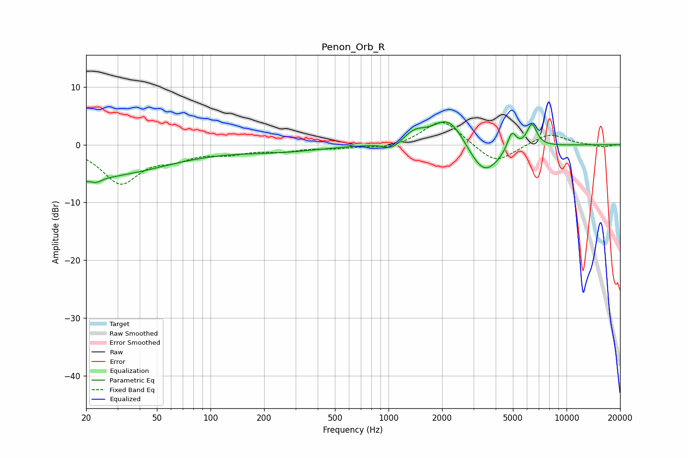

# Penon_Orb_R
See [usage instructions](https://github.com/jaakkopasanen/AutoEq#usage) for more options and info.

### Parametric EQs
Apply preamp of -4.0 dB when using parametric equalizer.

|   # | Type    |   Fc (Hz) |    Q |   Gain (dB) |
|-----|---------|-----------|------|-------------|
|   1 | Peaking |        21 | 5.58 |         3.3 |
|   2 | Peaking |        21 | 4.49 |        -4.3 |
|   3 | Peaking |        23 | 0.36 |        -5.4 |
|   4 | Peaking |       242 | 0.59 |        -1   |
|   5 | Peaking |      1044 | 3.17 |        -1.3 |
|   6 | Peaking |      1400 | 2.47 |         1.7 |
|   7 | Peaking |      2193 | 1.48 |         5.6 |
|   8 | Peaking |      3426 | 1.5  |        -6.1 |
|   9 | Peaking |      4927 | 5.37 |         3.3 |
|  10 | Peaking |      6384 | 4.8  |         4   |

### Fixed Band EQs
When using fixed band (also called graphic) equalizer, apply preamp of **-3.9 dB** (if available) and set gains manually with these parameters.

|   # | Type    |   Fc (Hz) |    Q |   Gain (dB) |
|-----|---------|-----------|------|-------------|
|   1 | Peaking |        31 | 1.41 |        -6.5 |
|   2 | Peaking |        62 | 1.41 |        -1.8 |
|   3 | Peaking |       125 | 1.41 |        -1.2 |
|   4 | Peaking |       250 | 1.41 |        -0.9 |
|   5 | Peaking |       500 | 1.41 |        -0.5 |
|   6 | Peaking |      1000 | 1.41 |        -0.7 |
|   7 | Peaking |      2000 | 1.41 |         4.5 |
|   8 | Peaking |      4000 | 1.41 |        -3.4 |
|   9 | Peaking |      8000 | 1.41 |         2   |
|  10 | Peaking |     16000 | 1.41 |        -0.4 |

### Graphs

