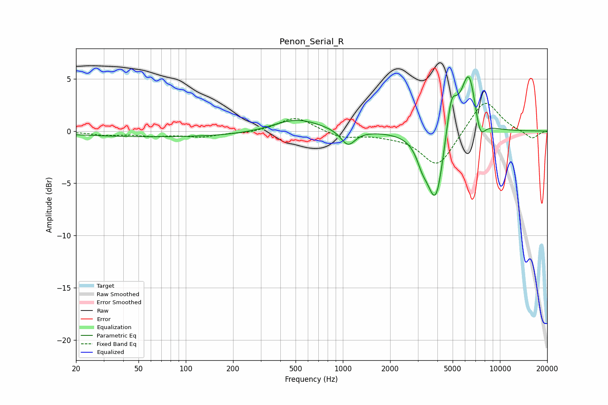

# Penon_Serial_R
See [usage instructions](https://github.com/jaakkopasanen/AutoEq#usage) for more options and info.

### Parametric EQs
Apply preamp of -5.3 dB when using parametric equalizer.

|   # | Type    |   Fc (Hz) |    Q |   Gain (dB) |
|-----|---------|-----------|------|-------------|
|   1 | Peaking |        87 | 0.19 |        -0.6 |
|   2 | Peaking |       505 | 0.9  |         1.4 |
|   3 | Peaking |      1078 | 3.11 |        -1.5 |
|   4 | Peaking |      3189 | 4.18 |        -1.1 |
|   5 | Peaking |      3561 | 2.2  |        -1.5 |
|   6 | Peaking |      3932 | 2.87 |        -6   |
|   7 | Peaking |      4900 | 4.71 |         2.8 |
|   8 | Peaking |      5062 | 2.34 |         1.3 |
|   9 | Peaking |      6359 | 2.86 |         5.7 |
|  10 | Peaking |      7449 | 4.06 |        -2.4 |

### Fixed Band EQs
When using fixed band (also called graphic) equalizer, apply preamp of **-2.7 dB** (if available) and set gains manually with these parameters.

|   # | Type    |   Fc (Hz) |    Q |   Gain (dB) |
|-----|---------|-----------|------|-------------|
|   1 | Peaking |        31 | 1.41 |        -0.3 |
|   2 | Peaking |        62 | 1.41 |        -0.4 |
|   3 | Peaking |       125 | 1.41 |        -0.5 |
|   4 | Peaking |       250 | 1.41 |        -0.2 |
|   5 | Peaking |       500 | 1.41 |         1.4 |
|   6 | Peaking |      1000 | 1.41 |        -0.7 |
|   7 | Peaking |      2000 | 1.41 |        -0.3 |
|   8 | Peaking |      4000 | 1.41 |        -3.4 |
|   9 | Peaking |      8000 | 1.41 |         3.2 |
|  10 | Peaking |     16000 | 1.41 |        -0.8 |

### Graphs

