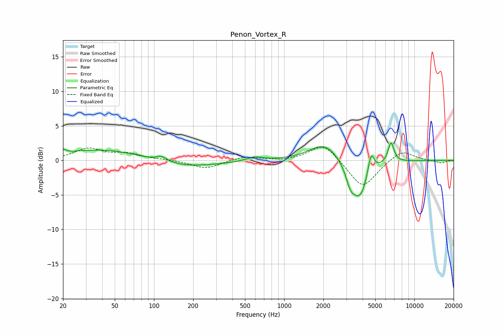

# Penon_Vortex_R
See [usage instructions](https://github.com/jaakkopasanen/AutoEq#usage) for more options and info.

### Parametric EQs
Apply preamp of -2.6 dB when using parametric equalizer.

|   # | Type    |   Fc (Hz) |    Q |   Gain (dB) |
|-----|---------|-----------|------|-------------|
|   1 | Peaking |        20 | 5.95 |         0.6 |
|   2 | Peaking |        41 | 0.46 |         1.6 |
|   3 | Peaking |       114 | 3.56 |         0.7 |
|   4 | Peaking |       171 | 0.54 |        -1.1 |
|   5 | Peaking |       595 | 2.23 |         0.6 |
|   6 | Peaking |      2034 | 1.24 |         2.6 |
|   7 | Peaking |      3224 | 4.29 |        -2.1 |
|   8 | Peaking |      3806 | 2.16 |        -5.5 |
|   9 | Peaking |      4643 | 5.96 |         3.2 |
|  10 | Peaking |      6610 | 6    |         2.9 |

### Fixed Band EQs
When using fixed band (also called graphic) equalizer, apply preamp of **-2.0 dB** (if available) and set gains manually with these parameters.

|   # | Type    |   Fc (Hz) |    Q |   Gain (dB) |
|-----|---------|-----------|------|-------------|
|   1 | Peaking |        31 | 1.41 |         1.6 |
|   2 | Peaking |        62 | 1.41 |         0.9 |
|   3 | Peaking |       125 | 1.41 |         0.1 |
|   4 | Peaking |       250 | 1.41 |        -1.2 |
|   5 | Peaking |       500 | 1.41 |         0.6 |
|   6 | Peaking |      1000 | 1.41 |        -0.1 |
|   7 | Peaking |      2000 | 1.41 |         2.5 |
|   8 | Peaking |      4000 | 1.41 |        -4.1 |
|   9 | Peaking |      8000 | 1.41 |         1.6 |
|  10 | Peaking |     16000 | 1.41 |        -0.4 |

### Graphs

