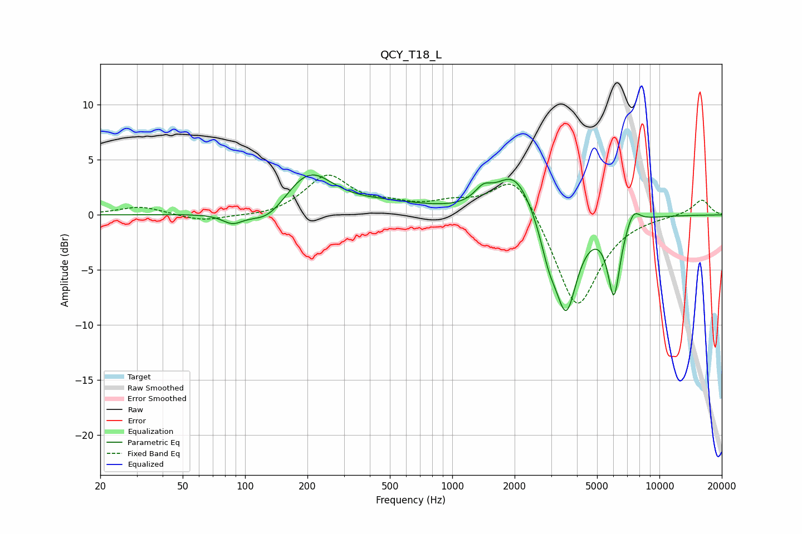

# QCY_T18_L
See [usage instructions](https://github.com/jaakkopasanen/AutoEq#usage) for more options and info.

### Parametric EQs
Apply preamp of -3.7 dB when using parametric equalizer.

|   # | Type    |   Fc (Hz) |    Q |   Gain (dB) |
|-----|---------|-----------|------|-------------|
|   1 | Peaking |        87 | 2.86 |        -0.9 |
|   2 | Peaking |       129 | 1.66 |        -1.5 |
|   3 | Peaking |       203 | 1.23 |         3.7 |
|   4 | Peaking |       482 | 0.68 |         0.8 |
|   5 | Peaking |      1411 | 3.44 |         1.2 |
|   6 | Peaking |      1997 | 1.57 |         3.9 |
|   7 | Peaking |      2921 | 3.38 |        -2.6 |
|   8 | Peaking |      3547 | 2.59 |        -8.5 |
|   9 | Peaking |      6032 | 4.58 |        -6.8 |
|  10 | Peaking |      7480 | 4.15 |         1.4 |

### Fixed Band EQs
When using fixed band (also called graphic) equalizer, apply preamp of **-3.7 dB** (if available) and set gains manually with these parameters.

|   # | Type    |   Fc (Hz) |    Q |   Gain (dB) |
|-----|---------|-----------|------|-------------|
|   1 | Peaking |        31 | 1.41 |         0.8 |
|   2 | Peaking |        62 | 1.41 |        -0.6 |
|   3 | Peaking |       125 | 1.41 |        -0.2 |
|   4 | Peaking |       250 | 1.41 |         3.5 |
|   5 | Peaking |       500 | 1.41 |         0.7 |
|   6 | Peaking |      1000 | 1.41 |         0.9 |
|   7 | Peaking |      2000 | 1.41 |         4.1 |
|   8 | Peaking |      4000 | 1.41 |        -8.8 |
|   9 | Peaking |      8000 | 1.41 |        -0   |
|  10 | Peaking |     16000 | 1.41 |         1.4 |

### Graphs

