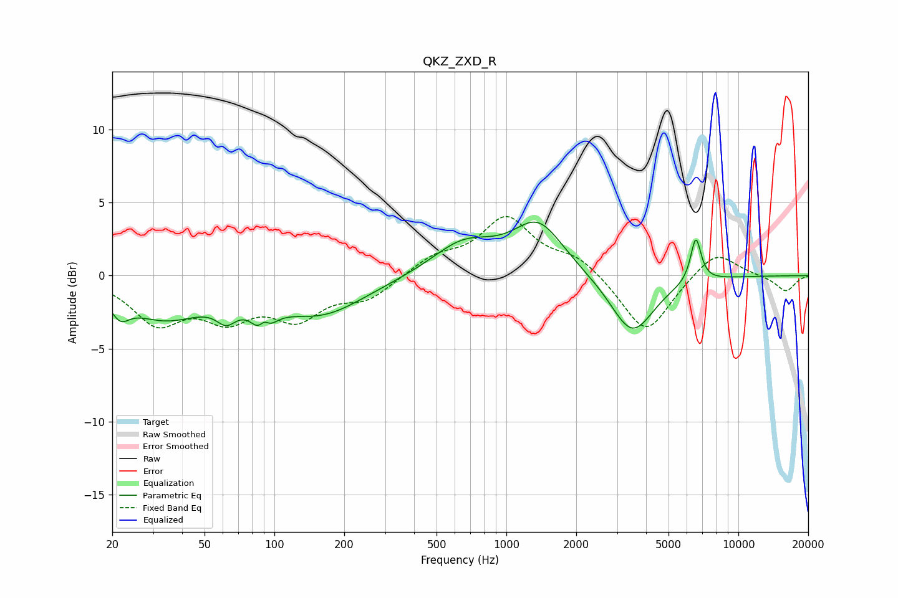

# QKZ_ZXD_R
See [usage instructions](https://github.com/jaakkopasanen/AutoEq#usage) for more options and info.

### Parametric EQs
Apply preamp of -3.8 dB when using parametric equalizer.

|   # | Type    |   Fc (Hz) |    Q |   Gain (dB) |
|-----|---------|-----------|------|-------------|
|   1 | Peaking |        22 | 3.7  |        -1.2 |
|   2 | Peaking |        34 | 0.8  |        -2.7 |
|   3 | Peaking |        62 | 3.37 |        -1.2 |
|   4 | Peaking |        90 | 3.84 |        -3   |
|   5 | Peaking |        90 | 5.8  |         2   |
|   6 | Peaking |       158 | 0.73 |        -2.6 |
|   7 | Peaking |       655 | 1.03 |         2.2 |
|   8 | Peaking |      1372 | 1.3  |         3.4 |
|   9 | Peaking |      3487 | 1.51 |        -4.1 |
|  10 | Peaking |      6556 | 6    |         3.1 |

### Fixed Band EQs
When using fixed band (also called graphic) equalizer, apply preamp of **-4.1 dB** (if available) and set gains manually with these parameters.

|   # | Type    |   Fc (Hz) |    Q |   Gain (dB) |
|-----|---------|-----------|------|-------------|
|   1 | Peaking |        31 | 1.41 |        -3   |
|   2 | Peaking |        62 | 1.41 |        -2.5 |
|   3 | Peaking |       125 | 1.41 |        -2.6 |
|   4 | Peaking |       250 | 1.41 |        -1.5 |
|   5 | Peaking |       500 | 1.41 |         1.2 |
|   6 | Peaking |      1000 | 1.41 |         3.8 |
|   7 | Peaking |      2000 | 1.41 |         1.2 |
|   8 | Peaking |      4000 | 1.41 |        -4.1 |
|   9 | Peaking |      8000 | 1.41 |         1.8 |
|  10 | Peaking |     16000 | 1.41 |        -1.1 |

### Graphs

