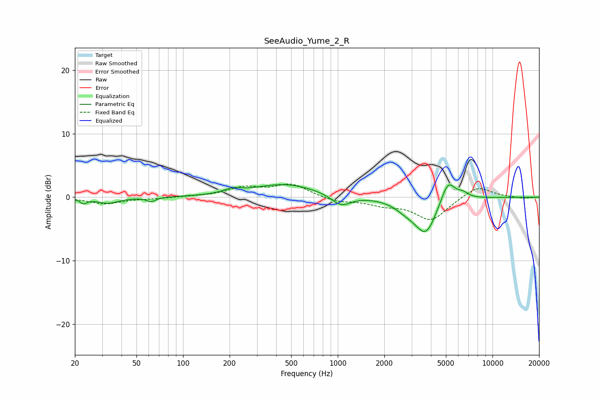

# SeeAudio_Yume_2_R
See [usage instructions](https://github.com/jaakkopasanen/AutoEq#usage) for more options and info.

### Parametric EQs
Apply preamp of -2.1 dB when using parametric equalizer.

|   # | Type    |   Fc (Hz) |    Q |   Gain (dB) |
|-----|---------|-----------|------|-------------|
|   1 | Peaking |        23 | 5.99 |        -0.8 |
|   2 | Peaking |        33 | 2.05 |        -0.9 |
|   3 | Peaking |        62 | 4.64 |        -0.7 |
|   4 | Peaking |       208 | 2.56 |         0.7 |
|   5 | Peaking |       456 | 0.69 |         2.1 |
|   6 | Peaking |      1051 | 2.27 |        -1.8 |
|   7 | Peaking |      2758 | 1.89 |        -1.2 |
|   8 | Peaking |      3711 | 1.99 |        -5.6 |
|   9 | Peaking |      5154 | 2.93 |         3.7 |
|  10 | Peaking |      6462 | 4.13 |         0.7 |

### Fixed Band EQs
When using fixed band (also called graphic) equalizer, apply preamp of **-2.2 dB** (if available) and set gains manually with these parameters.

|   # | Type    |   Fc (Hz) |    Q |   Gain (dB) |
|-----|---------|-----------|------|-------------|
|   1 | Peaking |        31 | 1.41 |        -1   |
|   2 | Peaking |        62 | 1.41 |        -0.2 |
|   3 | Peaking |       125 | 1.41 |         0.1 |
|   4 | Peaking |       250 | 1.41 |         1.4 |
|   5 | Peaking |       500 | 1.41 |         2   |
|   6 | Peaking |      1000 | 1.41 |        -0.7 |
|   7 | Peaking |      2000 | 1.41 |        -1   |
|   8 | Peaking |      4000 | 1.41 |        -3.6 |
|   9 | Peaking |      8000 | 1.41 |         1.9 |
|  10 | Peaking |     16000 | 1.41 |        -0.2 |

### Graphs

