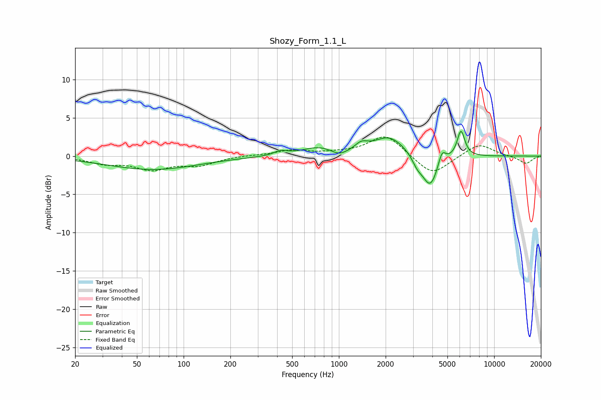

# Shozy_Form_1.1_L
See [usage instructions](https://github.com/jaakkopasanen/AutoEq#usage) for more options and info.

### Parametric EQs
Apply preamp of -3.3 dB when using parametric equalizer.

|   # | Type    |   Fc (Hz) |    Q |   Gain (dB) |
|-----|---------|-----------|------|-------------|
|   1 | Peaking |        63 | 0.48 |        -1.8 |
|   2 | Peaking |       421 | 3.44 |         0.5 |
|   3 | Peaking |       751 | 1.27 |         1.1 |
|   4 | Peaking |      1001 | 2.55 |        -0.8 |
|   5 | Peaking |      1394 | 3.48 |         0.9 |
|   6 | Peaking |      2119 | 1.38 |         2.5 |
|   7 | Peaking |      3202 | 4.29 |        -1.1 |
|   8 | Peaking |      3874 | 2.79 |        -4.3 |
|   9 | Peaking |      4614 | 6    |         1.8 |
|  10 | Peaking |      6112 | 5.58 |         3.4 |

### Fixed Band EQs
When using fixed band (also called graphic) equalizer, apply preamp of **-2.6 dB** (if available) and set gains manually with these parameters.

|   # | Type    |   Fc (Hz) |    Q |   Gain (dB) |
|-----|---------|-----------|------|-------------|
|   1 | Peaking |        31 | 1.41 |        -0.9 |
|   2 | Peaking |        62 | 1.41 |        -1.6 |
|   3 | Peaking |       125 | 1.41 |        -1.1 |
|   4 | Peaking |       250 | 1.41 |         0.1 |
|   5 | Peaking |       500 | 1.41 |         0.7 |
|   6 | Peaking |      1000 | 1.41 |         0.3 |
|   7 | Peaking |      2000 | 1.41 |         2.8 |
|   8 | Peaking |      4000 | 1.41 |        -2.6 |
|   9 | Peaking |      8000 | 1.41 |         1.7 |
|  10 | Peaking |     16000 | 1.41 |        -1   |

### Graphs

