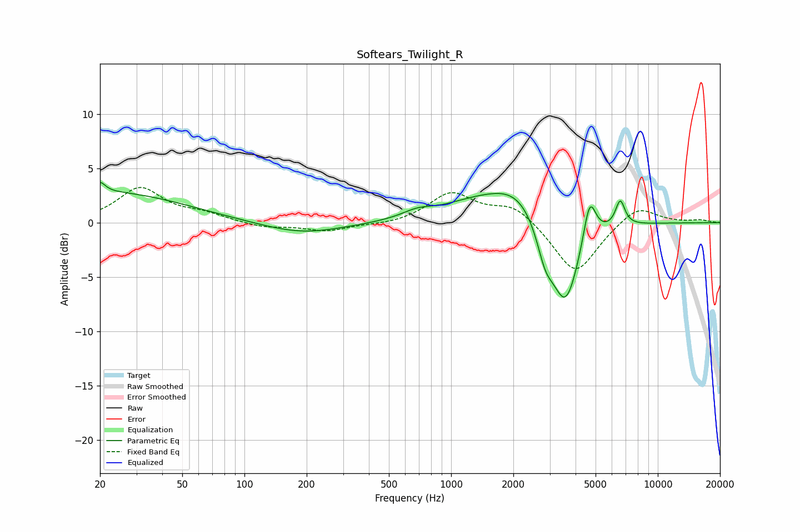

# Softears_Twilight_R
See [usage instructions](https://github.com/jaakkopasanen/AutoEq#usage) for more options and info.

### Parametric EQs
Apply preamp of -3.8 dB when using parametric equalizer.

|   # | Type    |   Fc (Hz) |    Q |   Gain (dB) |
|-----|---------|-----------|------|-------------|
|   1 | Peaking |        20 | 5.69 |         0.9 |
|   2 | Peaking |        21 | 0.37 |         2.8 |
|   3 | Peaking |       189 | 0.71 |        -1.1 |
|   4 | Peaking |       686 | 1.88 |         0.6 |
|   5 | Peaking |      1278 | 0.82 |         1.4 |
|   6 | Peaking |      2117 | 1.03 |         3   |
|   7 | Peaking |      2851 | 3.47 |        -2.8 |
|   8 | Peaking |      3573 | 2    |        -8.2 |
|   9 | Peaking |      4681 | 4.55 |         4.2 |
|  10 | Peaking |      6579 | 6    |         2.4 |

### Fixed Band EQs
When using fixed band (also called graphic) equalizer, apply preamp of **-3.3 dB** (if available) and set gains manually with these parameters.

|   # | Type    |   Fc (Hz) |    Q |   Gain (dB) |
|-----|---------|-----------|------|-------------|
|   1 | Peaking |        31 | 1.41 |         3.1 |
|   2 | Peaking |        62 | 1.41 |         0.7 |
|   3 | Peaking |       125 | 1.41 |        -0.5 |
|   4 | Peaking |       250 | 1.41 |        -0.8 |
|   5 | Peaking |       500 | 1.41 |        -0.2 |
|   6 | Peaking |      1000 | 1.41 |         2.7 |
|   7 | Peaking |      2000 | 1.41 |         1.6 |
|   8 | Peaking |      4000 | 1.41 |        -4.8 |
|   9 | Peaking |      8000 | 1.41 |         1.7 |
|  10 | Peaking |     16000 | 1.41 |         0.2 |

### Graphs

