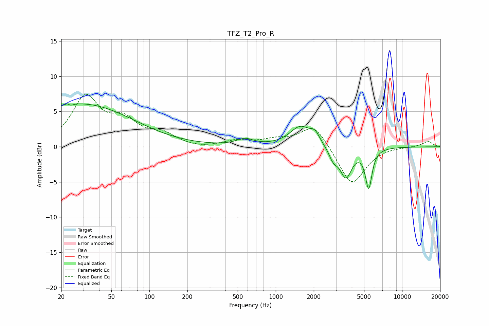

# TFZ_T2_Pro_R
See [usage instructions](https://github.com/jaakkopasanen/AutoEq#usage) for more options and info.

### Parametric EQs
Apply preamp of -6.2 dB when using parametric equalizer.

|   # | Type    |   Fc (Hz) |    Q |   Gain (dB) |
|-----|---------|-----------|------|-------------|
|   1 | Peaking |        23 | 5.61 |         3.3 |
|   2 | Peaking |        23 | 5.94 |        -3.3 |
|   3 | Peaking |        24 | 0.29 |         1   |
|   4 | Peaking |        29 | 0.35 |         5.1 |
|   5 | Peaking |       570 | 2.17 |         0.9 |
|   6 | Peaking |      1566 | 1.71 |         2.8 |
|   7 | Peaking |      2044 | 3.75 |         1.3 |
|   8 | Peaking |      2857 | 4.09 |        -1.5 |
|   9 | Peaking |      3595 | 3    |        -4.2 |
|  10 | Peaking |      5442 | 5.36 |        -5.5 |

### Fixed Band EQs
When using fixed band (also called graphic) equalizer, apply preamp of **-7.6 dB** (if available) and set gains manually with these parameters.

|   # | Type    |   Fc (Hz) |    Q |   Gain (dB) |
|-----|---------|-----------|------|-------------|
|   1 | Peaking |        31 | 1.41 |         6.8 |
|   2 | Peaking |        62 | 1.41 |         3.2 |
|   3 | Peaking |       125 | 1.41 |         1.6 |
|   4 | Peaking |       250 | 1.41 |        -0.3 |
|   5 | Peaking |       500 | 1.41 |         0.8 |
|   6 | Peaking |      1000 | 1.41 |         0.8 |
|   7 | Peaking |      2000 | 1.41 |         3.3 |
|   8 | Peaking |      4000 | 1.41 |        -5.6 |
|   9 | Peaking |      8000 | 1.41 |         0.1 |
|  10 | Peaking |     16000 | 1.41 |         0.8 |

### Graphs

