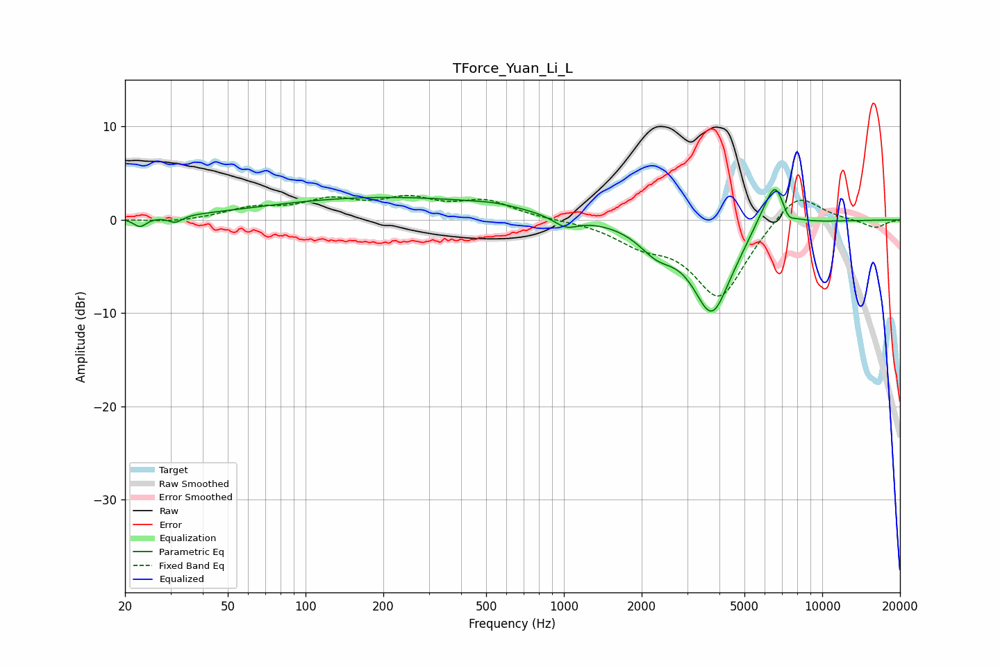

# TForce_Yuan_Li_L
See [usage instructions](https://github.com/jaakkopasanen/AutoEq#usage) for more options and info.

### Parametric EQs
Apply preamp of -3.3 dB when using parametric equalizer.

|   # | Type    |   Fc (Hz) |    Q |   Gain (dB) |
|-----|---------|-----------|------|-------------|
|   1 | Peaking |        23 | 5.9  |        -1   |
|   2 | Peaking |        31 | 5.49 |        -0.7 |
|   3 | Peaking |       207 | 0.29 |         2.4 |
|   4 | Peaking |       539 | 1.59 |         0.3 |
|   5 | Peaking |      1017 | 2.93 |        -1.2 |
|   6 | Peaking |      2290 | 1.99 |        -2.3 |
|   7 | Peaking |      3741 | 1.81 |        -9.7 |
|   8 | Peaking |      5682 | 3.52 |         0.9 |
|   9 | Peaking |      6558 | 3.36 |         4.9 |
|  10 | Peaking |      7377 | 5.99 |        -1.1 |

### Fixed Band EQs
When using fixed band (also called graphic) equalizer, apply preamp of **-2.7 dB** (if available) and set gains manually with these parameters.

|   # | Type    |   Fc (Hz) |    Q |   Gain (dB) |
|-----|---------|-----------|------|-------------|
|   1 | Peaking |        31 | 1.41 |        -0.3 |
|   2 | Peaking |        62 | 1.41 |         1.1 |
|   3 | Peaking |       125 | 1.41 |         1.8 |
|   4 | Peaking |       250 | 1.41 |         1.9 |
|   5 | Peaking |       500 | 1.41 |         1.9 |
|   6 | Peaking |      1000 | 1.41 |         0   |
|   7 | Peaking |      2000 | 1.41 |        -2   |
|   8 | Peaking |      4000 | 1.41 |        -8.3 |
|   9 | Peaking |      8000 | 1.41 |         3.4 |
|  10 | Peaking |     16000 | 1.41 |        -0.9 |

### Graphs

