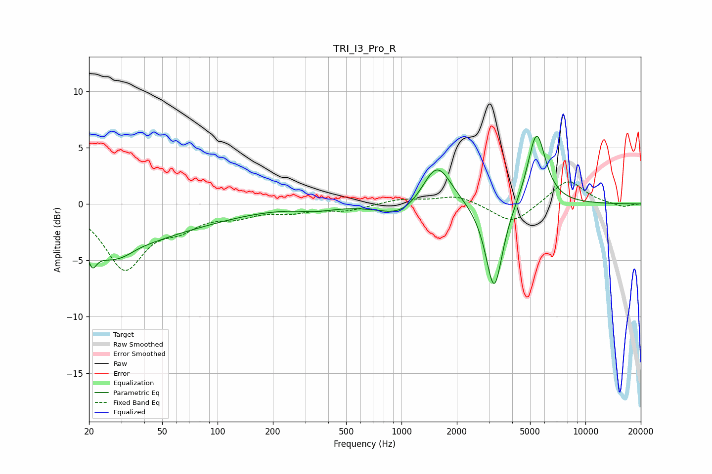

# TRI_I3_Pro_R
See [usage instructions](https://github.com/jaakkopasanen/AutoEq#usage) for more options and info.

### Parametric EQs
Apply preamp of -6.1 dB when using parametric equalizer.

|   # | Type    |   Fc (Hz) |    Q |   Gain (dB) |
|-----|---------|-----------|------|-------------|
|   1 | Peaking |        21 | 5.84 |        -5   |
|   2 | Peaking |        21 | 5.75 |         3.3 |
|   3 | Peaking |        27 | 0.79 |        -4.3 |
|   4 | Peaking |        37 | 1.77 |         0.4 |
|   5 | Peaking |        68 | 0.5  |        -1.3 |
|   6 | Peaking |       344 | 1.47 |        -0.4 |
|   7 | Peaking |      1007 | 1.24 |        -1.3 |
|   8 | Peaking |      1558 | 1.79 |         3.9 |
|   9 | Peaking |      3190 | 3.02 |        -8   |
|  10 | Peaking |      5423 | 2.81 |         6.6 |

### Fixed Band EQs
When using fixed band (also called graphic) equalizer, apply preamp of **-2.0 dB** (if available) and set gains manually with these parameters.

|   # | Type    |   Fc (Hz) |    Q |   Gain (dB) |
|-----|---------|-----------|------|-------------|
|   1 | Peaking |        31 | 1.41 |        -5.6 |
|   2 | Peaking |        62 | 1.41 |        -1.6 |
|   3 | Peaking |       125 | 1.41 |        -0.9 |
|   4 | Peaking |       250 | 1.41 |        -0.6 |
|   5 | Peaking |       500 | 1.41 |        -0.6 |
|   6 | Peaking |      1000 | 1.41 |         0.4 |
|   7 | Peaking |      2000 | 1.41 |         0.8 |
|   8 | Peaking |      4000 | 1.41 |        -1.8 |
|   9 | Peaking |      8000 | 1.41 |         2.2 |
|  10 | Peaking |     16000 | 1.41 |        -0.3 |

### Graphs

