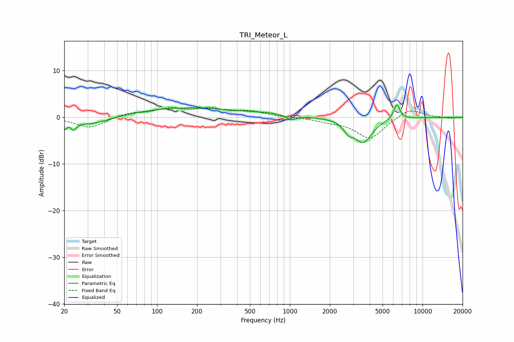

# TRI_Meteor_L
See [usage instructions](https://github.com/jaakkopasanen/AutoEq#usage) for more options and info.

### Parametric EQs
Apply preamp of -2.7 dB when using parametric equalizer.

|   # | Type    |   Fc (Hz) |    Q |   Gain (dB) |
|-----|---------|-----------|------|-------------|
|   1 | Peaking |        20 | 5.96 |        -2.2 |
|   2 | Peaking |        22 | 5.91 |         1.2 |
|   3 | Peaking |        23 | 5.86 |        -2   |
|   4 | Peaking |        32 | 1.09 |        -1.6 |
|   5 | Peaking |       162 | 0.39 |         2.1 |
|   6 | Peaking |       691 | 0.87 |         0.5 |
|   7 | Peaking |      1020 | 3.97 |        -1   |
|   8 | Peaking |      2760 | 4.1  |        -1.8 |
|   9 | Peaking |      3567 | 2.11 |        -5.2 |
|  10 | Peaking |      6388 | 5.86 |         3.2 |

### Fixed Band EQs
When using fixed band (also called graphic) equalizer, apply preamp of **-2.2 dB** (if available) and set gains manually with these parameters.

|   # | Type    |   Fc (Hz) |    Q |   Gain (dB) |
|-----|---------|-----------|------|-------------|
|   1 | Peaking |        31 | 1.41 |        -2.3 |
|   2 | Peaking |        62 | 1.41 |         0.9 |
|   3 | Peaking |       125 | 1.41 |         1.7 |
|   4 | Peaking |       250 | 1.41 |         1.6 |
|   5 | Peaking |       500 | 1.41 |         1.1 |
|   6 | Peaking |      1000 | 1.41 |         0.1 |
|   7 | Peaking |      2000 | 1.41 |        -0.7 |
|   8 | Peaking |      4000 | 1.41 |        -4.6 |
|   9 | Peaking |      8000 | 1.41 |         2   |
|  10 | Peaking |     16000 | 1.41 |        -0.2 |

### Graphs

