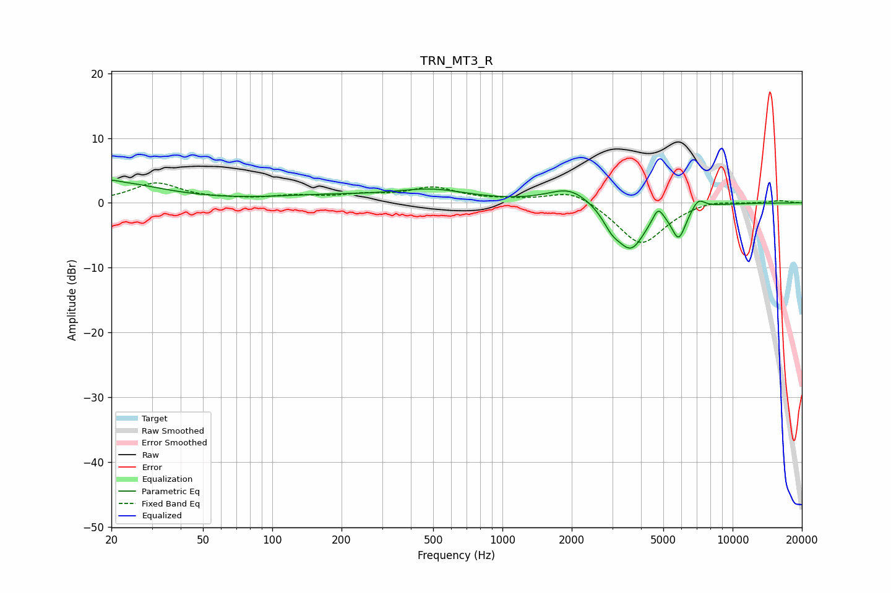

# TRN_MT3_R
See [usage instructions](https://github.com/jaakkopasanen/AutoEq#usage) for more options and info.

### Parametric EQs
Apply preamp of -3.6 dB when using parametric equalizer.

|   # | Type    |   Fc (Hz) |    Q |   Gain (dB) |
|-----|---------|-----------|------|-------------|
|   1 | Peaking |        20 | 5.32 |         0.3 |
|   2 | Peaking |        20 | 0.67 |         3.1 |
|   3 | Peaking |       172 | 0.58 |         1   |
|   4 | Peaking |       493 | 0.87 |         1.8 |
|   5 | Peaking |      1961 | 1.52 |         2.5 |
|   6 | Peaking |      2985 | 3.63 |        -2   |
|   7 | Peaking |      3618 | 2.15 |        -6.9 |
|   8 | Peaking |      4745 | 6    |         2.2 |
|   9 | Peaking |      5834 | 4.4  |        -4.8 |
|  10 | Peaking |      7094 | 4.93 |         1.6 |

### Fixed Band EQs
When using fixed band (also called graphic) equalizer, apply preamp of **-3.2 dB** (if available) and set gains manually with these parameters.

|   # | Type    |   Fc (Hz) |    Q |   Gain (dB) |
|-----|---------|-----------|------|-------------|
|   1 | Peaking |        31 | 1.41 |         3   |
|   2 | Peaking |        62 | 1.41 |         0.3 |
|   3 | Peaking |       125 | 1.41 |         0.9 |
|   4 | Peaking |       250 | 1.41 |         1   |
|   5 | Peaking |       500 | 1.41 |         2.2 |
|   6 | Peaking |      1000 | 1.41 |         0.3 |
|   7 | Peaking |      2000 | 1.41 |         2.2 |
|   8 | Peaking |      4000 | 1.41 |        -6.6 |
|   9 | Peaking |      8000 | 1.41 |         0.7 |
|  10 | Peaking |     16000 | 1.41 |         0.4 |

### Graphs

