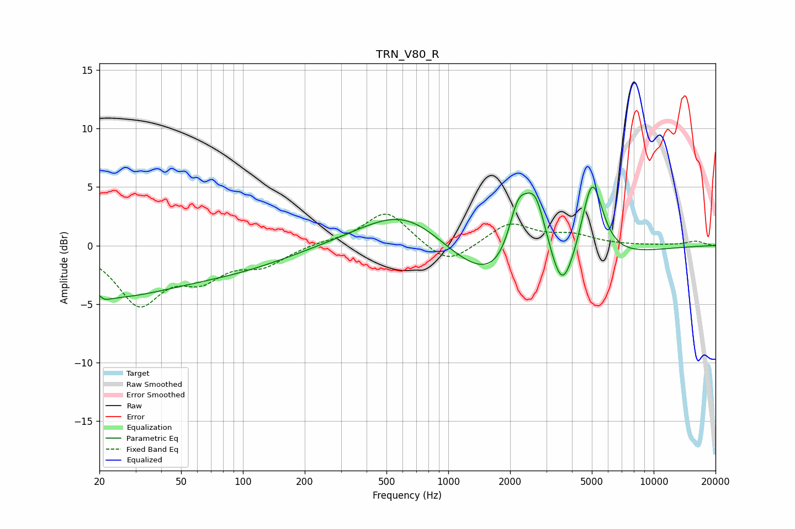

# TRN_V80_R
See [usage instructions](https://github.com/jaakkopasanen/AutoEq#usage) for more options and info.

### Parametric EQs
Apply preamp of -5.1 dB when using parametric equalizer.

|   # | Type    |   Fc (Hz) |    Q |   Gain (dB) |
|-----|---------|-----------|------|-------------|
|   1 | Peaking |        20 | 5.32 |         3.5 |
|   2 | Peaking |        20 | 5.05 |        -3.4 |
|   3 | Peaking |        20 | 0.38 |        -4.2 |
|   4 | Peaking |        96 | 0.51 |        -1.4 |
|   5 | Peaking |       638 | 0.64 |         4   |
|   6 | Peaking |      2091 | 0.45 |        -5.3 |
|   7 | Peaking |      2180 | 2.88 |         4.5 |
|   8 | Peaking |      2652 | 2.21 |         7   |
|   9 | Peaking |      3586 | 2.76 |        -3.3 |
|  10 | Peaking |      5014 | 2.59 |         7.5 |

### Fixed Band EQs
When using fixed band (also called graphic) equalizer, apply preamp of **-2.8 dB** (if available) and set gains manually with these parameters.

|   # | Type    |   Fc (Hz) |    Q |   Gain (dB) |
|-----|---------|-----------|------|-------------|
|   1 | Peaking |        31 | 1.41 |        -4.8 |
|   2 | Peaking |        62 | 1.41 |        -2.4 |
|   3 | Peaking |       125 | 1.41 |        -1.5 |
|   4 | Peaking |       250 | 1.41 |         0.3 |
|   5 | Peaking |       500 | 1.41 |         3   |
|   6 | Peaking |      1000 | 1.41 |        -1.8 |
|   7 | Peaking |      2000 | 1.41 |         1.9 |
|   8 | Peaking |      4000 | 1.41 |         0.8 |
|   9 | Peaking |      8000 | 1.41 |        -0   |
|  10 | Peaking |     16000 | 1.41 |         0.4 |

### Graphs

