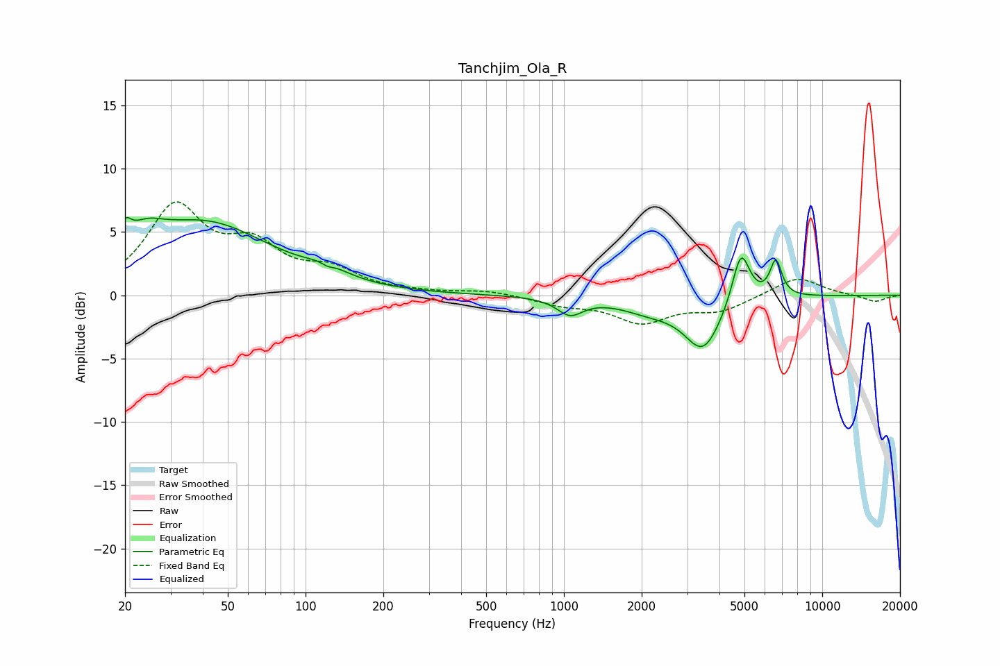

# Tanchjim_Ola_R
See [usage instructions](https://github.com/jaakkopasanen/AutoEq#usage) for more options and info.

### Parametric EQs
Apply preamp of -6.2 dB when using parametric equalizer.

|   # | Type    |   Fc (Hz) |    Q |   Gain (dB) |
|-----|---------|-----------|------|-------------|
|   1 | Peaking |        20 | 6    |         1.7 |
|   2 | Peaking |        24 | 2.04 |         1.6 |
|   3 | Peaking |        40 | 0.54 |         5.6 |
|   4 | Peaking |       120 | 2.02 |         0.8 |
|   5 | Peaking |       121 | 5.89 |        -0.3 |
|   6 | Peaking |      1057 | 2.86 |        -1.3 |
|   7 | Peaking |      2154 | 1.24 |        -1   |
|   8 | Peaking |      3461 | 1.96 |        -4.1 |
|   9 | Peaking |      4846 | 4.1  |         4.3 |
|  10 | Peaking |      6614 | 6    |         2.8 |

### Fixed Band EQs
When using fixed band (also called graphic) equalizer, apply preamp of **-7.5 dB** (if available) and set gains manually with these parameters.

|   # | Type    |   Fc (Hz) |    Q |   Gain (dB) |
|-----|---------|-----------|------|-------------|
|   1 | Peaking |        31 | 1.41 |         6.7 |
|   2 | Peaking |        62 | 1.41 |         3.3 |
|   3 | Peaking |       125 | 1.41 |         1.7 |
|   4 | Peaking |       250 | 1.41 |         0.1 |
|   5 | Peaking |       500 | 1.41 |         0.4 |
|   6 | Peaking |      1000 | 1.41 |        -0.7 |
|   7 | Peaking |      2000 | 1.41 |        -2   |
|   8 | Peaking |      4000 | 1.41 |        -1.1 |
|   9 | Peaking |      8000 | 1.41 |         1.5 |
|  10 | Peaking |     16000 | 1.41 |        -0.5 |

### Graphs

