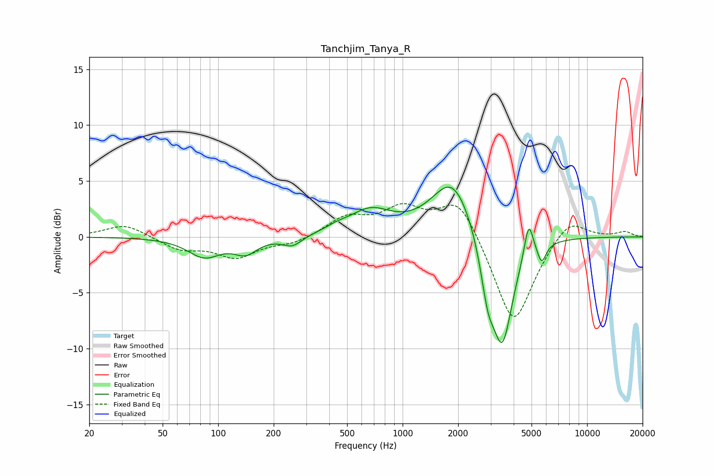

# Tanchjim_Tanya_R
See [usage instructions](https://github.com/jaakkopasanen/AutoEq#usage) for more options and info.

### Parametric EQs
Apply preamp of -4.5 dB when using parametric equalizer.

|   # | Type    |   Fc (Hz) |    Q |   Gain (dB) |
|-----|---------|-----------|------|-------------|
|   1 | Peaking |        84 | 1.59 |        -1.7 |
|   2 | Peaking |       141 | 2.28 |        -1.3 |
|   3 | Peaking |       252 | 2.69 |        -0.9 |
|   4 | Peaking |       440 | 2.21 |         0.4 |
|   5 | Peaking |       669 | 1.23 |         2.1 |
|   6 | Peaking |      1870 | 1.25 |         5.4 |
|   7 | Peaking |      2895 | 3.65 |        -3.9 |
|   8 | Peaking |      3476 | 2.42 |        -9.7 |
|   9 | Peaking |      4824 | 5.81 |         3.2 |
|  10 | Peaking |      5673 | 6    |        -1.7 |

### Fixed Band EQs
When using fixed band (also called graphic) equalizer, apply preamp of **-3.1 dB** (if available) and set gains manually with these parameters.

|   # | Type    |   Fc (Hz) |    Q |   Gain (dB) |
|-----|---------|-----------|------|-------------|
|   1 | Peaking |        31 | 1.41 |         1.2 |
|   2 | Peaking |        62 | 1.41 |        -1.1 |
|   3 | Peaking |       125 | 1.41 |        -1.8 |
|   4 | Peaking |       250 | 1.41 |        -0.6 |
|   5 | Peaking |       500 | 1.41 |         1.7 |
|   6 | Peaking |      1000 | 1.41 |         2.3 |
|   7 | Peaking |      2000 | 1.41 |         3.6 |
|   8 | Peaking |      4000 | 1.41 |        -8.1 |
|   9 | Peaking |      8000 | 1.41 |         2   |
|  10 | Peaking |     16000 | 1.41 |         0.5 |

### Graphs

