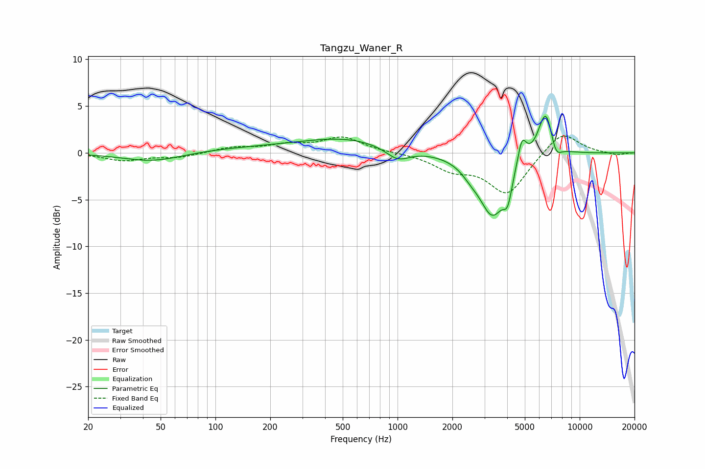

# Tangzu_Waner_R
See [usage instructions](https://github.com/jaakkopasanen/AutoEq#usage) for more options and info.

### Parametric EQs
Apply preamp of -4.0 dB when using parametric equalizer.

|   # | Type    |   Fc (Hz) |    Q |   Gain (dB) |
|-----|---------|-----------|------|-------------|
|   1 | Peaking |        46 | 0.85 |        -1   |
|   2 | Peaking |       139 | 0.4  |         0.5 |
|   3 | Peaking |       524 | 0.57 |         1.4 |
|   4 | Peaking |      1002 | 2.14 |        -1.3 |
|   5 | Peaking |      2511 | 2.78 |        -0.8 |
|   6 | Peaking |      3323 | 1.9  |        -6.5 |
|   7 | Peaking |      4024 | 6    |        -2.4 |
|   8 | Peaking |      4821 | 5.81 |         2.8 |
|   9 | Peaking |      6522 | 3.26 |         5.2 |
|  10 | Peaking |      7371 | 4.38 |        -1.9 |

### Fixed Band EQs
When using fixed band (also called graphic) equalizer, apply preamp of **-1.9 dB** (if available) and set gains manually with these parameters.

|   # | Type    |   Fc (Hz) |    Q |   Gain (dB) |
|-----|---------|-----------|------|-------------|
|   1 | Peaking |        31 | 1.41 |        -0.8 |
|   2 | Peaking |        62 | 1.41 |        -0.5 |
|   3 | Peaking |       125 | 1.41 |         0.6 |
|   4 | Peaking |       250 | 1.41 |         0.7 |
|   5 | Peaking |       500 | 1.41 |         1.6 |
|   6 | Peaking |      1000 | 1.41 |         0   |
|   7 | Peaking |      2000 | 1.41 |        -1.6 |
|   8 | Peaking |      4000 | 1.41 |        -4.3 |
|   9 | Peaking |      8000 | 1.41 |         2.4 |
|  10 | Peaking |     16000 | 1.41 |        -0.3 |

### Graphs

