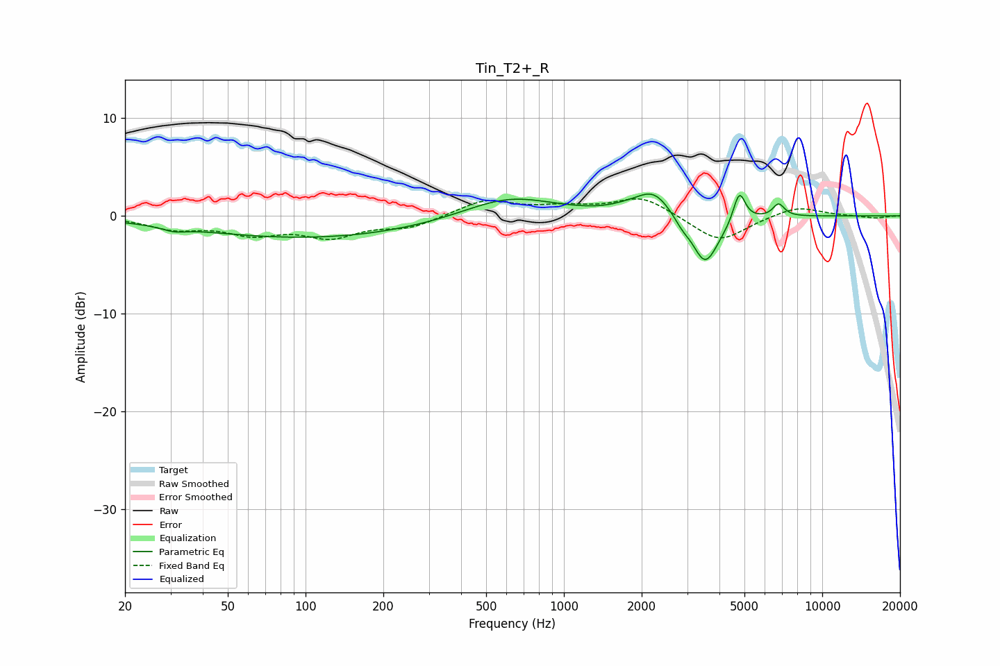

# Tin_T2+_R
See [usage instructions](https://github.com/jaakkopasanen/AutoEq#usage) for more options and info.

### Parametric EQs
Apply preamp of -2.3 dB when using parametric equalizer.

|   # | Type    |   Fc (Hz) |    Q |   Gain (dB) |
|-----|---------|-----------|------|-------------|
|   1 | Peaking |        31 | 3.1  |        -0.4 |
|   2 | Peaking |       105 | 0.31 |        -2.3 |
|   3 | Peaking |       612 | 0.81 |         2.2 |
|   4 | Peaking |      1764 | 1.99 |         0.4 |
|   5 | Peaking |      2227 | 2.13 |         2.4 |
|   6 | Peaking |      2869 | 4.52 |        -0.8 |
|   7 | Peaking |      3507 | 3    |        -4.2 |
|   8 | Peaking |      3849 | 1.98 |        -1   |
|   9 | Peaking |      4775 | 6    |         3.2 |
|  10 | Peaking |      6779 | 6    |         1.3 |

### Fixed Band EQs
When using fixed band (also called graphic) equalizer, apply preamp of **-1.8 dB** (if available) and set gains manually with these parameters.

|   # | Type    |   Fc (Hz) |    Q |   Gain (dB) |
|-----|---------|-----------|------|-------------|
|   1 | Peaking |        31 | 1.41 |        -1.2 |
|   2 | Peaking |        62 | 1.41 |        -1.6 |
|   3 | Peaking |       125 | 1.41 |        -1.9 |
|   4 | Peaking |       250 | 1.41 |        -1.1 |
|   5 | Peaking |       500 | 1.41 |         1.6 |
|   6 | Peaking |      1000 | 1.41 |         0.7 |
|   7 | Peaking |      2000 | 1.41 |         2   |
|   8 | Peaking |      4000 | 1.41 |        -2.8 |
|   9 | Peaking |      8000 | 1.41 |         1   |
|  10 | Peaking |     16000 | 1.41 |        -0.2 |

### Graphs

