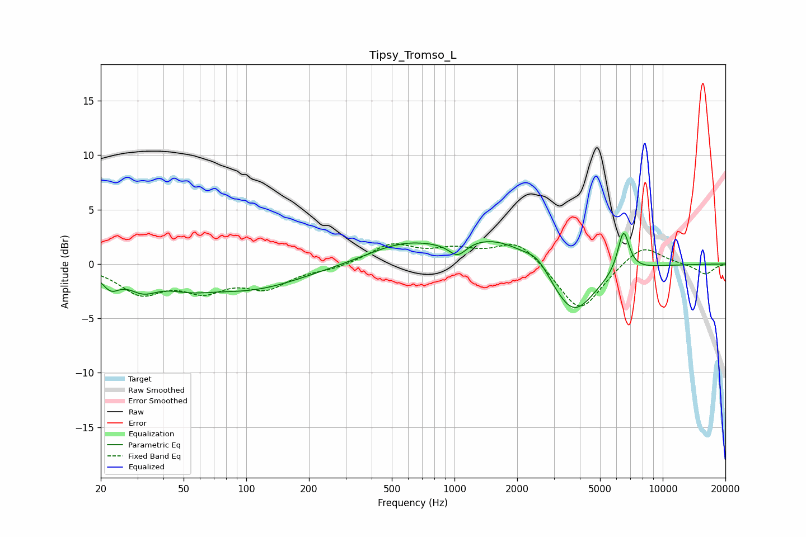

# Tipsy_Tromso_L
See [usage instructions](https://github.com/jaakkopasanen/AutoEq#usage) for more options and info.

### Parametric EQs
Apply preamp of -2.9 dB when using parametric equalizer.

|   # | Type    |   Fc (Hz) |    Q |   Gain (dB) |
|-----|---------|-----------|------|-------------|
|   1 | Peaking |        22 | 3.33 |        -1.5 |
|   2 | Peaking |        32 | 1.93 |        -1.6 |
|   3 | Peaking |        52 | 1.26 |        -0.9 |
|   4 | Peaking |       103 | 0.55 |        -2.3 |
|   5 | Peaking |       564 | 0.79 |         1.7 |
|   6 | Peaking |      1035 | 3.34 |        -1.3 |
|   7 | Peaking |      1573 | 0.76 |         2.3 |
|   8 | Peaking |      2511 | 2.55 |         1   |
|   9 | Peaking |      3708 | 1.31 |        -5   |
|  10 | Peaking |      6481 | 4.9  |         3.9 |

### Fixed Band EQs
When using fixed band (also called graphic) equalizer, apply preamp of **-2.0 dB** (if available) and set gains manually with these parameters.

|   # | Type    |   Fc (Hz) |    Q |   Gain (dB) |
|-----|---------|-----------|------|-------------|
|   1 | Peaking |        31 | 1.41 |        -2.5 |
|   2 | Peaking |        62 | 1.41 |        -2.1 |
|   3 | Peaking |       125 | 1.41 |        -2   |
|   4 | Peaking |       250 | 1.41 |        -0.4 |
|   5 | Peaking |       500 | 1.41 |         1.8 |
|   6 | Peaking |      1000 | 1.41 |         1.1 |
|   7 | Peaking |      2000 | 1.41 |         2.2 |
|   8 | Peaking |      4000 | 1.41 |        -4.6 |
|   9 | Peaking |      8000 | 1.41 |         1.9 |
|  10 | Peaking |     16000 | 1.41 |        -1   |

### Graphs

