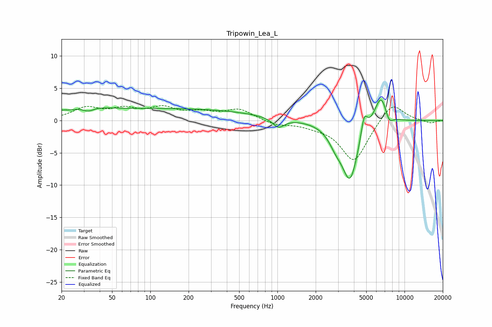

# Tripowin_Lea_L
See [usage instructions](https://github.com/jaakkopasanen/AutoEq#usage) for more options and info.

### Parametric EQs
Apply preamp of -3.3 dB when using parametric equalizer.

|   # | Type    |   Fc (Hz) |    Q |   Gain (dB) |
|-----|---------|-----------|------|-------------|
|   1 | Peaking |        20 | 4.18 |         0.4 |
|   2 | Peaking |        31 | 1.22 |         1.3 |
|   3 | Peaking |        32 | 2.73 |        -1   |
|   4 | Peaking |       136 | 0.18 |         1.8 |
|   5 | Peaking |      1018 | 3.07 |        -1.5 |
|   6 | Peaking |      2882 | 2.51 |        -1.9 |
|   7 | Peaking |      3728 | 2.17 |        -8.9 |
|   8 | Peaking |      4816 | 5.69 |         3.3 |
|   9 | Peaking |      6522 | 2.64 |         4.6 |
|  10 | Peaking |      7547 | 4.31 |        -1.6 |

### Fixed Band EQs
When using fixed band (also called graphic) equalizer, apply preamp of **-2.4 dB** (if available) and set gains manually with these parameters.

|   # | Type    |   Fc (Hz) |    Q |   Gain (dB) |
|-----|---------|-----------|------|-------------|
|   1 | Peaking |        31 | 1.41 |         1.8 |
|   2 | Peaking |        62 | 1.41 |         1.5 |
|   3 | Peaking |       125 | 1.41 |         1.7 |
|   4 | Peaking |       250 | 1.41 |         1   |
|   5 | Peaking |       500 | 1.41 |         1.7 |
|   6 | Peaking |      1000 | 1.41 |        -0.7 |
|   7 | Peaking |      2000 | 1.41 |        -0.6 |
|   8 | Peaking |      4000 | 1.41 |        -6.4 |
|   9 | Peaking |      8000 | 1.41 |         3   |
|  10 | Peaking |     16000 | 1.41 |        -0.4 |

### Graphs

