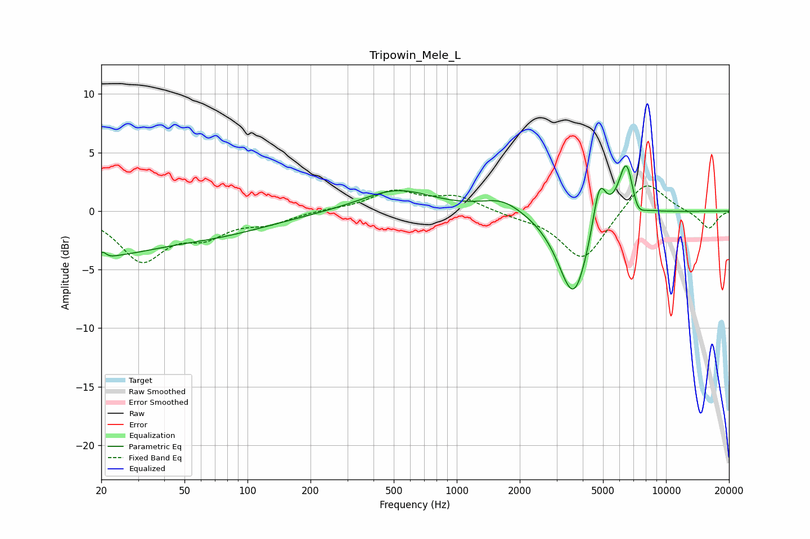

# Tripowin_Mele_L
See [usage instructions](https://github.com/jaakkopasanen/AutoEq#usage) for more options and info.

### Parametric EQs
Apply preamp of -3.9 dB when using parametric equalizer.

|   # | Type    |   Fc (Hz) |    Q |   Gain (dB) |
|-----|---------|-----------|------|-------------|
|   1 | Peaking |        20 | 0.54 |        -3.2 |
|   2 | Peaking |        20 | 5.07 |        -2.8 |
|   3 | Peaking |        20 | 5.96 |         2.9 |
|   4 | Peaking |        71 | 0.49 |        -1.6 |
|   5 | Peaking |       516 | 0.84 |         1.9 |
|   6 | Peaking |      1653 | 1.42 |         1.1 |
|   7 | Peaking |      3622 | 1.89 |        -7.6 |
|   8 | Peaking |      4804 | 4.25 |         4.3 |
|   9 | Peaking |      6486 | 3.49 |         5.3 |
|  10 | Peaking |      7214 | 3.89 |        -1.7 |

### Fixed Band EQs
When using fixed band (also called graphic) equalizer, apply preamp of **-2.2 dB** (if available) and set gains manually with these parameters.

|   # | Type    |   Fc (Hz) |    Q |   Gain (dB) |
|-----|---------|-----------|------|-------------|
|   1 | Peaking |        31 | 1.41 |        -4   |
|   2 | Peaking |        62 | 1.41 |        -1.8 |
|   3 | Peaking |       125 | 1.41 |        -0.9 |
|   4 | Peaking |       250 | 1.41 |         0.1 |
|   5 | Peaking |       500 | 1.41 |         1.6 |
|   6 | Peaking |      1000 | 1.41 |         1.2 |
|   7 | Peaking |      2000 | 1.41 |        -0.3 |
|   8 | Peaking |      4000 | 1.41 |        -4.2 |
|   9 | Peaking |      8000 | 1.41 |         2.8 |
|  10 | Peaking |     16000 | 1.41 |        -1.5 |

### Graphs

