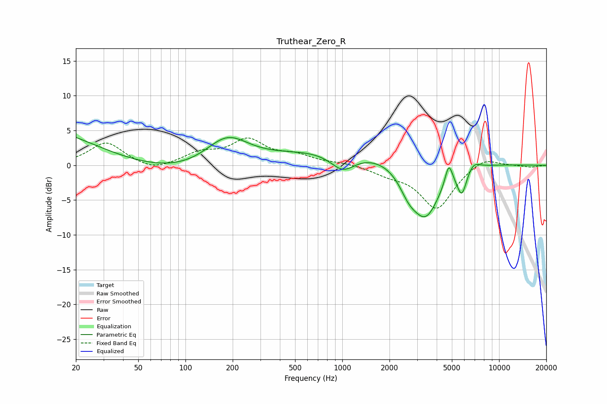

# Truthear_Zero_R
See [usage instructions](https://github.com/jaakkopasanen/AutoEq#usage) for more options and info.

### Parametric EQs
Apply preamp of -4.1 dB when using parametric equalizer.

|   # | Type    |   Fc (Hz) |    Q |   Gain (dB) |
|-----|---------|-----------|------|-------------|
|   1 | Peaking |        28 | 0.18 |        10.3 |
|   2 | Peaking |        62 | 0.26 |        -9.7 |
|   3 | Peaking |       184 | 0.99 |         4.6 |
|   4 | Peaking |       993 | 0.18 |         2.8 |
|   5 | Peaking |      1009 | 1.75 |        -2.7 |
|   6 | Peaking |      2644 | 2.45 |        -2.2 |
|   7 | Peaking |      3397 | 1.4  |        -8.6 |
|   8 | Peaking |      4778 | 5.85 |         3.1 |
|   9 | Peaking |      5785 | 4.42 |        -3.7 |
|  10 | Peaking |      6840 | 3.4  |         1.2 |

### Fixed Band EQs
When using fixed band (also called graphic) equalizer, apply preamp of **-4.0 dB** (if available) and set gains manually with these parameters.

|   # | Type    |   Fc (Hz) |    Q |   Gain (dB) |
|-----|---------|-----------|------|-------------|
|   1 | Peaking |        31 | 1.41 |         3.3 |
|   2 | Peaking |        62 | 1.41 |        -1   |
|   3 | Peaking |       125 | 1.41 |         1.6 |
|   4 | Peaking |       250 | 1.41 |         3.4 |
|   5 | Peaking |       500 | 1.41 |         1.2 |
|   6 | Peaking |      1000 | 1.41 |         0.3 |
|   7 | Peaking |      2000 | 1.41 |        -1   |
|   8 | Peaking |      4000 | 1.41 |        -6.2 |
|   9 | Peaking |      8000 | 1.41 |         1.4 |
|  10 | Peaking |     16000 | 1.41 |        -0.3 |

### Graphs

