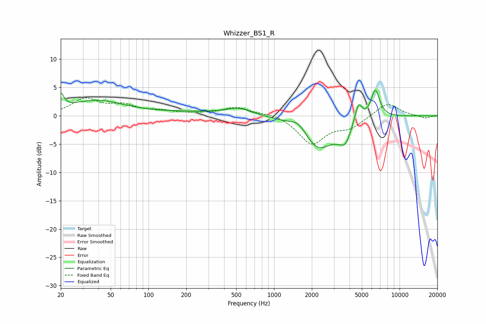

# Whizzer_BS1_R
See [usage instructions](https://github.com/jaakkopasanen/AutoEq#usage) for more options and info.

### Parametric EQs
Apply preamp of -4.6 dB when using parametric equalizer.

|   # | Type    |   Fc (Hz) |    Q |   Gain (dB) |
|-----|---------|-----------|------|-------------|
|   1 | Peaking |        20 | 6    |         2.5 |
|   2 | Peaking |        38 | 0.64 |         2.6 |
|   3 | Peaking |       251 | 0.36 |         0.6 |
|   4 | Peaking |       525 | 1.51 |         1.1 |
|   5 | Peaking |      1571 | 2.2  |         1.8 |
|   6 | Peaking |      2249 | 1.12 |        -5.9 |
|   7 | Peaking |      3281 | 2.87 |        -0.9 |
|   8 | Peaking |      3724 | 3.52 |        -2.6 |
|   9 | Peaking |      4708 | 4.96 |         3.3 |
|  10 | Peaking |      6409 | 3.88 |         5   |

### Fixed Band EQs
When using fixed band (also called graphic) equalizer, apply preamp of **-3.3 dB** (if available) and set gains manually with these parameters.

|   # | Type    |   Fc (Hz) |    Q |   Gain (dB) |
|-----|---------|-----------|------|-------------|
|   1 | Peaking |        31 | 1.41 |         2.8 |
|   2 | Peaking |        62 | 1.41 |         1.6 |
|   3 | Peaking |       125 | 1.41 |         0.7 |
|   4 | Peaking |       250 | 1.41 |         0.2 |
|   5 | Peaking |       500 | 1.41 |         1.5 |
|   6 | Peaking |      1000 | 1.41 |         0.5 |
|   7 | Peaking |      2000 | 1.41 |        -4.9 |
|   8 | Peaking |      4000 | 1.41 |        -1.9 |
|   9 | Peaking |      8000 | 1.41 |         2.4 |
|  10 | Peaking |     16000 | 1.41 |        -0.5 |

### Graphs

