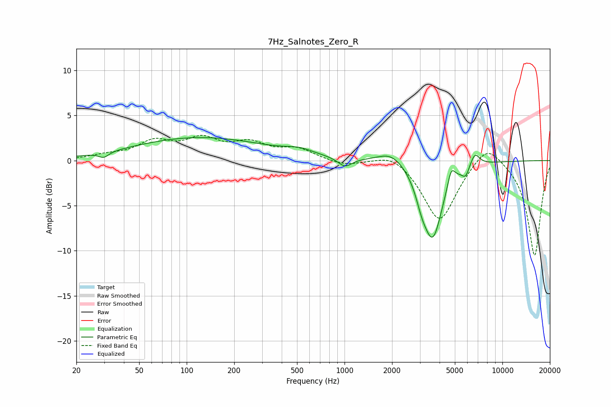

# 7Hz_Salnotes_Zero_R
See [usage instructions](https://github.com/jaakkopasanen/AutoEq#usage) for more options and info.

### Parametric EQs
Apply preamp of -2.6 dB when using parametric equalizer.

|   # | Type    |   Fc (Hz) |    Q |   Gain (dB) |
|-----|---------|-----------|------|-------------|
|   1 | Peaking |        30 | 4.49 |        -0.6 |
|   2 | Peaking |       121 | 0.33 |         2.5 |
|   3 | Peaking |       519 | 1.55 |         0.6 |
|   4 | Peaking |      1006 | 3.25 |        -1   |
|   5 | Peaking |      1983 | 1.67 |         1.3 |
|   6 | Peaking |      3077 | 3.96 |        -1.5 |
|   7 | Peaking |      3619 | 2.22 |        -8.3 |
|   8 | Peaking |      4742 | 6    |         1.9 |
|   9 | Peaking |      5852 | 5.89 |        -1.1 |
|  10 | Peaking |      6689 | 4.43 |         1.5 |

### Fixed Band EQs
When using fixed band (also called graphic) equalizer, apply preamp of **-2.9 dB** (if available) and set gains manually with these parameters.

|   # | Type    |   Fc (Hz) |    Q |   Gain (dB) |
|-----|---------|-----------|------|-------------|
|   1 | Peaking |        31 | 1.41 |         0.5 |
|   2 | Peaking |        62 | 1.41 |         1.9 |
|   3 | Peaking |       125 | 1.41 |         2.1 |
|   4 | Peaking |       250 | 1.41 |         1.7 |
|   5 | Peaking |       500 | 1.41 |         1.2 |
|   6 | Peaking |      1000 | 1.41 |        -0.6 |
|   7 | Peaking |      2000 | 1.41 |         1.1 |
|   8 | Peaking |      4000 | 1.41 |        -6.8 |
|   9 | Peaking |      8000 | 1.41 |         2.4 |
|  10 | Peaking |     16000 | 1.41 |       -10.6 |

### Graphs

