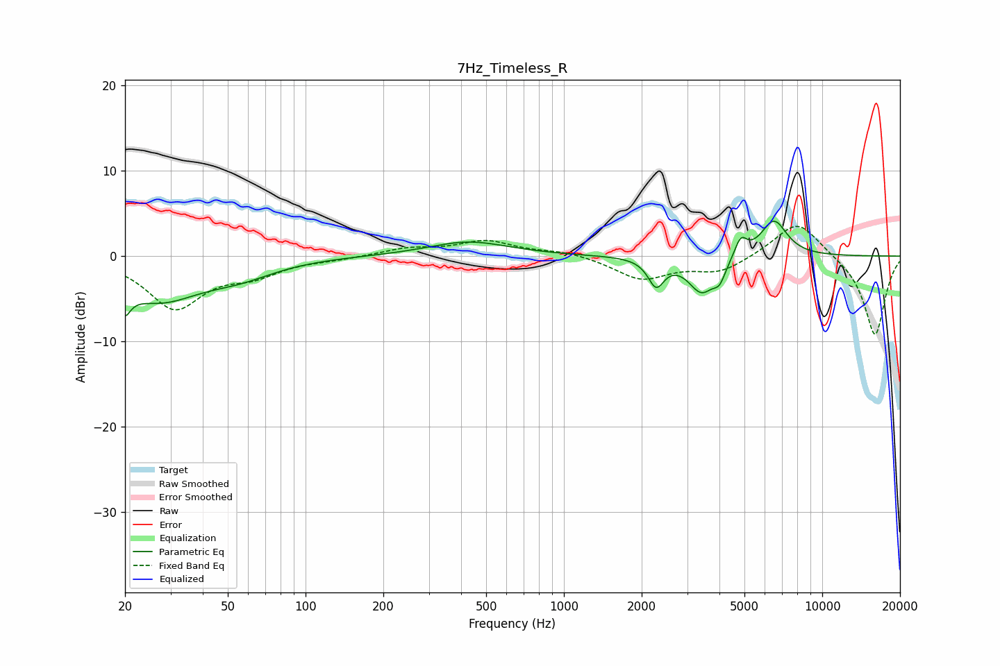

# 7Hz_Timeless_R
See [usage instructions](https://github.com/jaakkopasanen/AutoEq#usage) for more options and info.

### Parametric EQs
Apply preamp of -4.2 dB when using parametric equalizer.

|   # | Type    |   Fc (Hz) |    Q |   Gain (dB) |
|-----|---------|-----------|------|-------------|
|   1 | Peaking |        20 | 5.84 |        -6.2 |
|   2 | Peaking |        20 | 5.97 |         3.2 |
|   3 | Peaking |        27 | 0.86 |        -4.9 |
|   4 | Peaking |        56 | 1.02 |        -1.6 |
|   5 | Peaking |       427 | 0.91 |         1.7 |
|   6 | Peaking |      2276 | 4.58 |        -3.2 |
|   7 | Peaking |      3415 | 2.71 |        -4.1 |
|   8 | Peaking |      4006 | 5.94 |        -1.8 |
|   9 | Peaking |      4838 | 5.95 |         2.2 |
|  10 | Peaking |      6498 | 2.67 |         4.3 |

### Fixed Band EQs
When using fixed band (also called graphic) equalizer, apply preamp of **-3.6 dB** (if available) and set gains manually with these parameters.

|   # | Type    |   Fc (Hz) |    Q |   Gain (dB) |
|-----|---------|-----------|------|-------------|
|   1 | Peaking |        31 | 1.41 |        -6   |
|   2 | Peaking |        62 | 1.41 |        -1.8 |
|   3 | Peaking |       125 | 1.41 |        -0.3 |
|   4 | Peaking |       250 | 1.41 |         0.9 |
|   5 | Peaking |       500 | 1.41 |         1.7 |
|   6 | Peaking |      1000 | 1.41 |         0.6 |
|   7 | Peaking |      2000 | 1.41 |        -2.6 |
|   8 | Peaking |      4000 | 1.41 |        -1.8 |
|   9 | Peaking |      8000 | 1.41 |         4.4 |
|  10 | Peaking |     16000 | 1.41 |        -9.4 |

### Graphs

