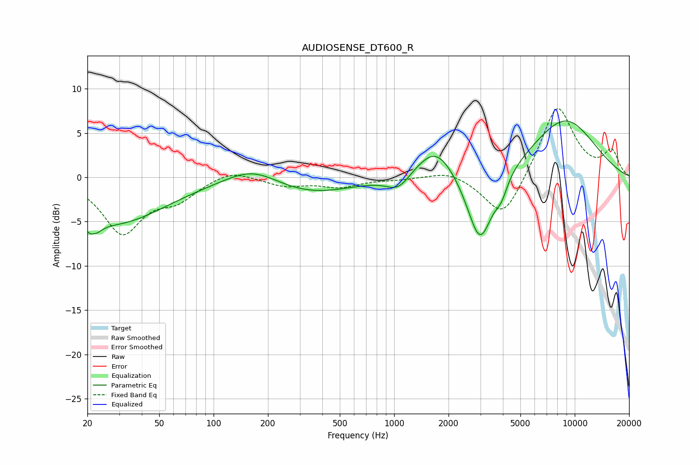

# AUDIOSENSE_DT600_R
See [usage instructions](https://github.com/jaakkopasanen/AutoEq#usage) for more options and info.

### Parametric EQs
Apply preamp of -6.5 dB when using parametric equalizer.

|   # | Type    |   Fc (Hz) |    Q |   Gain (dB) |
|-----|---------|-----------|------|-------------|
|   1 | Peaking |        21 | 4.59 |        -5.2 |
|   2 | Peaking |        21 | 5.67 |         3.4 |
|   3 | Peaking |        29 | 0.51 |        -5.1 |
|   4 | Peaking |       165 | 0.94 |         2.1 |
|   5 | Peaking |       332 | 0.57 |        -2   |
|   6 | Peaking |      1053 | 2.15 |        -1.7 |
|   7 | Peaking |      1702 | 1.31 |         3.9 |
|   8 | Peaking |      2988 | 1.93 |        -8.6 |
|   9 | Peaking |      3926 | 4.27 |        -1.6 |
|  10 | Peaking |      8763 | 0.68 |         6.6 |

### Fixed Band EQs
When using fixed band (also called graphic) equalizer, apply preamp of **-7.9 dB** (if available) and set gains manually with these parameters.

|   # | Type    |   Fc (Hz) |    Q |   Gain (dB) |
|-----|---------|-----------|------|-------------|
|   1 | Peaking |        31 | 1.41 |        -6.1 |
|   2 | Peaking |        62 | 1.41 |        -2.1 |
|   3 | Peaking |       125 | 1.41 |         1   |
|   4 | Peaking |       250 | 1.41 |        -0.9 |
|   5 | Peaking |       500 | 1.41 |        -1   |
|   6 | Peaking |      1000 | 1.41 |        -0.2 |
|   7 | Peaking |      2000 | 1.41 |         0.8 |
|   8 | Peaking |      4000 | 1.41 |        -5   |
|   9 | Peaking |      8000 | 1.41 |         8.3 |
|  10 | Peaking |     16000 | 1.41 |         2.8 |

### Graphs

