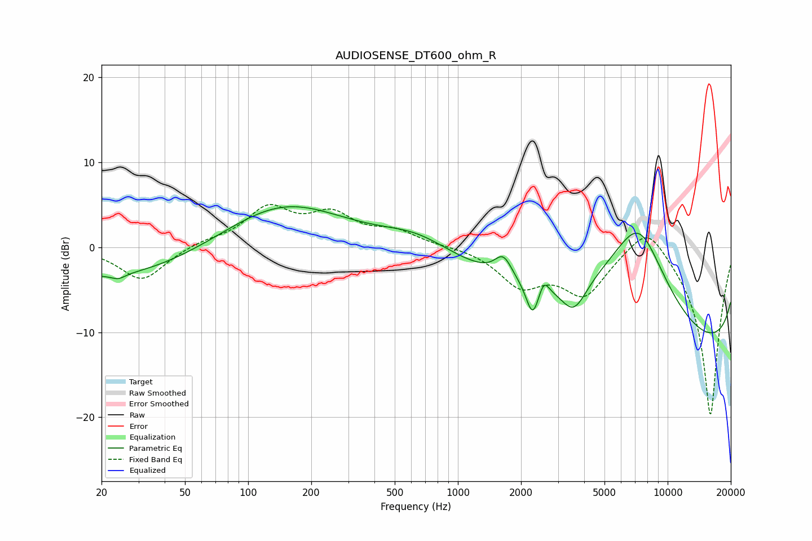

# AUDIOSENSE_DT600_ohm_R
See [usage instructions](https://github.com/jaakkopasanen/AutoEq#usage) for more options and info.

### Parametric EQs
Apply preamp of -4.9 dB when using parametric equalizer.

|   # | Type    |   Fc (Hz) |    Q |   Gain (dB) |
|-----|---------|-----------|------|-------------|
|   1 | Peaking |        23 | 0.34 |        -3.7 |
|   2 | Peaking |        24 | 4.44 |        -0.6 |
|   3 | Peaking |       147 | 0.5  |         5.3 |
|   4 | Peaking |       641 | 0.84 |         2.1 |
|   5 | Peaking |      1647 | 3.47 |         2.5 |
|   6 | Peaking |      2272 | 4.62 |        -4   |
|   7 | Peaking |      2567 | 5.92 |         1.8 |
|   8 | Peaking |      3568 | 2.26 |        -3.8 |
|   9 | Peaking |      7274 | 0.56 |        20   |
|  10 | Peaking |     10000 | 0.18 |       -19   |

### Fixed Band EQs
When using fixed band (also called graphic) equalizer, apply preamp of **-5.1 dB** (if available) and set gains manually with these parameters.

|   # | Type    |   Fc (Hz) |    Q |   Gain (dB) |
|-----|---------|-----------|------|-------------|
|   1 | Peaking |        31 | 1.41 |        -3.9 |
|   2 | Peaking |        62 | 1.41 |         0.6 |
|   3 | Peaking |       125 | 1.41 |         4.3 |
|   4 | Peaking |       250 | 1.41 |         3.4 |
|   5 | Peaking |       500 | 1.41 |         1.7 |
|   6 | Peaking |      1000 | 1.41 |         0.1 |
|   7 | Peaking |      2000 | 1.41 |        -4.2 |
|   8 | Peaking |      4000 | 1.41 |        -5.2 |
|   9 | Peaking |      8000 | 1.41 |         3.8 |
|  10 | Peaking |     16000 | 1.41 |       -20   |

### Graphs

