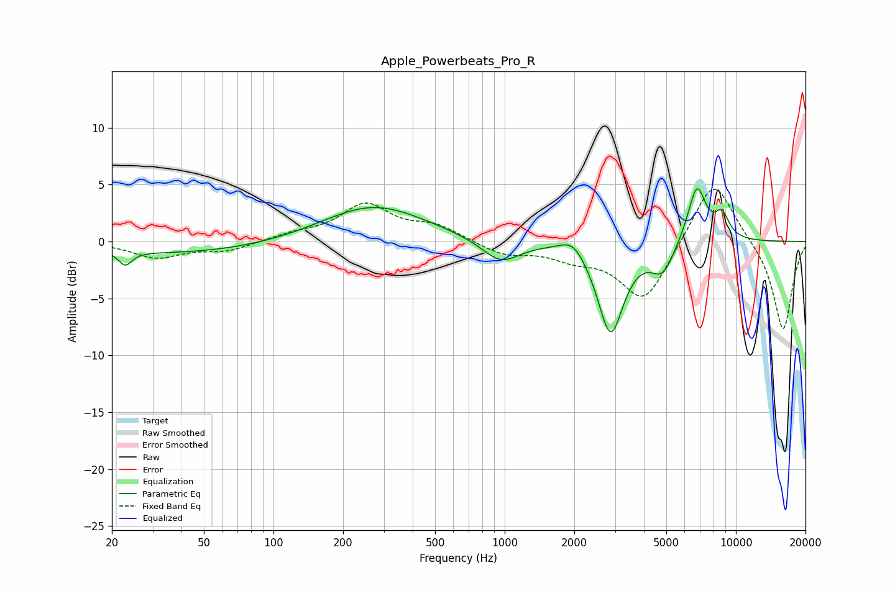

# Apple_Powerbeats_Pro_R
See [usage instructions](https://github.com/jaakkopasanen/AutoEq#usage) for more options and info.

### Parametric EQs
Apply preamp of -4.7 dB when using parametric equalizer.

|   # | Type    |   Fc (Hz) |    Q |   Gain (dB) |
|-----|---------|-----------|------|-------------|
|   1 | Peaking |        23 | 4.99 |        -1.2 |
|   2 | Peaking |        41 | 0.34 |        -1.1 |
|   3 | Peaking |       270 | 0.63 |         3.2 |
|   4 | Peaking |       961 | 1.72 |        -2   |
|   5 | Peaking |      1976 | 2.58 |         1.4 |
|   6 | Peaking |      2871 | 2.49 |        -8.1 |
|   7 | Peaking |      4825 | 2.74 |        -2.5 |
|   8 | Peaking |      6517 | 4.76 |        -0.6 |
|   9 | Peaking |      6738 | 3.42 |         5.6 |
|  10 | Peaking |      8699 | 4.01 |         2.1 |

### Fixed Band EQs
When using fixed band (also called graphic) equalizer, apply preamp of **-4.7 dB** (if available) and set gains manually with these parameters.

|   # | Type    |   Fc (Hz) |    Q |   Gain (dB) |
|-----|---------|-----------|------|-------------|
|   1 | Peaking |        31 | 1.41 |        -1.4 |
|   2 | Peaking |        62 | 1.41 |        -0.8 |
|   3 | Peaking |       125 | 1.41 |         0.6 |
|   4 | Peaking |       250 | 1.41 |         3.1 |
|   5 | Peaking |       500 | 1.41 |         1.3 |
|   6 | Peaking |      1000 | 1.41 |        -1.1 |
|   7 | Peaking |      2000 | 1.41 |        -1.2 |
|   8 | Peaking |      4000 | 1.41 |        -5.3 |
|   9 | Peaking |      8000 | 1.41 |         5.8 |
|  10 | Peaking |     16000 | 1.41 |        -7.9 |

### Graphs

