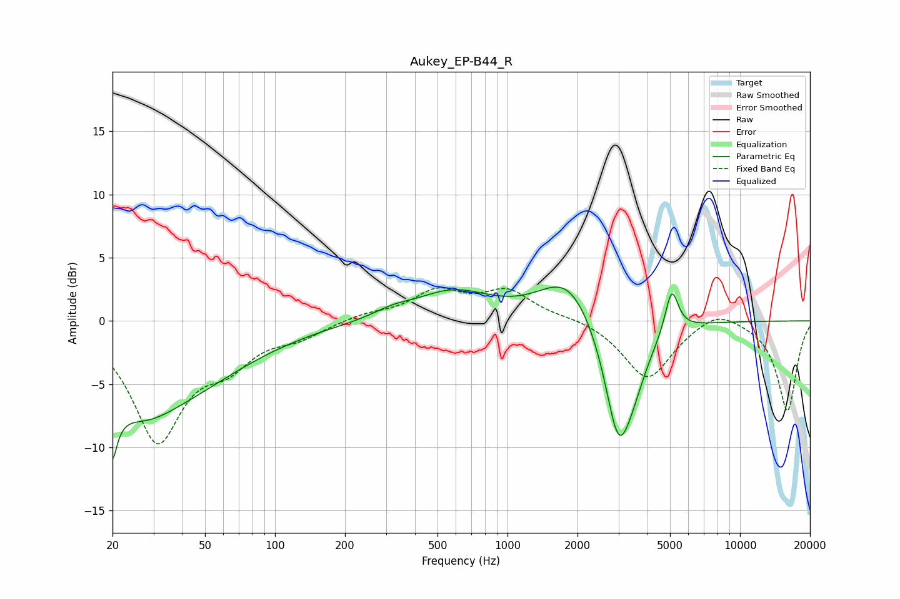

# Aukey_EP-B44_R
See [usage instructions](https://github.com/jaakkopasanen/AutoEq#usage) for more options and info.

### Parametric EQs
Apply preamp of -2.8 dB when using parametric equalizer.

|   # | Type    |   Fc (Hz) |    Q |   Gain (dB) |
|-----|---------|-----------|------|-------------|
|   1 | Peaking |        20 | 5.63 |        -7.8 |
|   2 | Peaking |        20 | 5.87 |         3.3 |
|   3 | Peaking |        27 | 1.25 |        -1.3 |
|   4 | Peaking |        30 | 0.42 |        -6.2 |
|   5 | Peaking |       320 | 1.73 |         0.5 |
|   6 | Peaking |       581 | 0.87 |         2.2 |
|   7 | Peaking |      1817 | 1.17 |         3.6 |
|   8 | Peaking |      2996 | 2.33 |        -8.8 |
|   9 | Peaking |      3470 | 2.12 |        -2.6 |
|  10 | Peaking |      5083 | 4.96 |         3.5 |

### Fixed Band EQs
When using fixed band (also called graphic) equalizer, apply preamp of **-2.7 dB** (if available) and set gains manually with these parameters.

|   # | Type    |   Fc (Hz) |    Q |   Gain (dB) |
|-----|---------|-----------|------|-------------|
|   1 | Peaking |        31 | 1.41 |        -9.2 |
|   2 | Peaking |        62 | 1.41 |        -2.6 |
|   3 | Peaking |       125 | 1.41 |        -1.1 |
|   4 | Peaking |       250 | 1.41 |         0.5 |
|   5 | Peaking |       500 | 1.41 |         2.2 |
|   6 | Peaking |      1000 | 1.41 |         2.2 |
|   7 | Peaking |      2000 | 1.41 |         0.3 |
|   8 | Peaking |      4000 | 1.41 |        -4.6 |
|   9 | Peaking |      8000 | 1.41 |         1.2 |
|  10 | Peaking |     16000 | 1.41 |        -7.1 |

### Graphs

